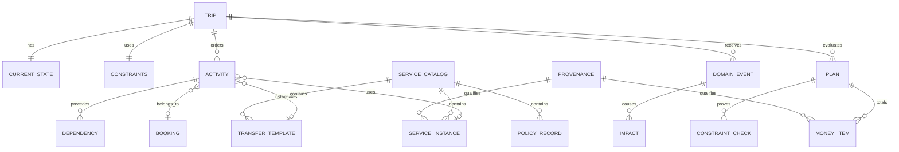
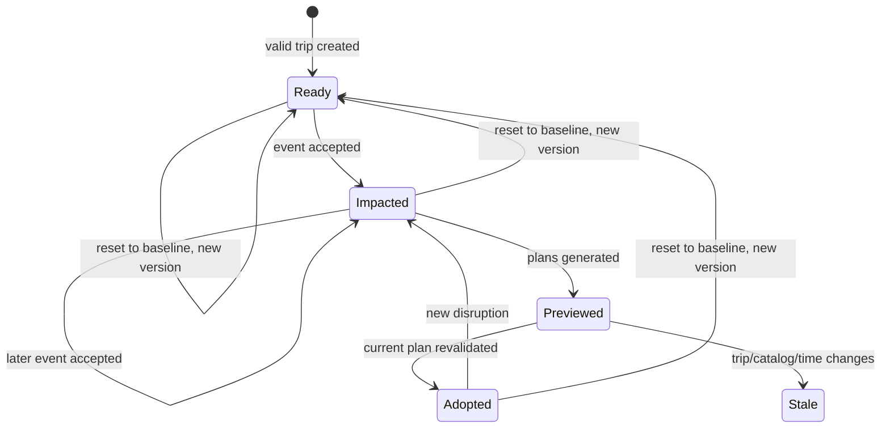
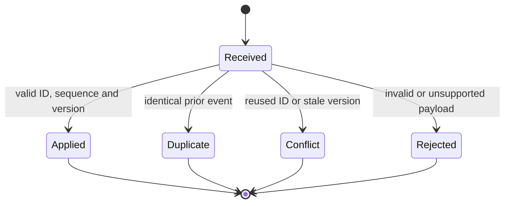

# ResiliTrip — Domain Model and India Travel Glossary

**Document:** 03 of the ResiliTrip implementation pack  
**Version:** 1.0  
**Date:** 6 September 2026  
**Status:** Retained current-demo reference
**Future authority:** `IMPLEMENTATION_PLAN.md`; this document does not limit the
generic-trip roadmap.
**Feeds:** Fixture Specification, Algorithm Specification and API/Data Contracts

## 1. Purpose

This document defines the shared language and conceptual data model for ResiliTrip. It gives product, frontend, backend, planning and QA work the same meaning for a trip, service, activity, dependency, disruption, plan, money item and source.

It is a domain specification rather than executable JSON Schema. Document 07 will turn these concepts into exact Pydantic models, OpenAPI schemas and generated frontend types. That contract may add serialization detail, but it must preserve the meanings and invariants defined here.

Normative language:

- **MUST** is required for P0 behavior.
- **MUST NOT** is prohibited for P0 behavior.
- **SHOULD** is the default unless a recorded design decision provides a reason to differ.
- **MAY** is optional and cannot become a hidden dependency.

## 2. Domain boundary

ResiliTrip models one traveler’s proposed physical journey and the commitments that depend on it. It evaluates a bounded catalog of fictional alternatives under time, location, capacity, money and commitment constraints.

The domain begins with:

- a validated itinerary and financial baseline;
- the traveler’s current time, location and boarding phase;
- a versioned catalog of services, transfers and fictional policies;
- a disruption event or constraint change.

The domain ends with:

- impact records for the current itinerary;
- a bounded set of feasible and rejected plan evaluations;
- an internally adopted proposed itinerary;
- a checklist of external provider actions.

External booking execution, payment, cancellation, refunds, entitlement decisions and provider inventory ownership remain outside the domain.

## 3. Core model at a glance



The diagram shows references, not database-table cardinalities. The storage design may use versioned JSON snapshots, normalized indexes or both.

## 4. Essential distinctions

### 4.1 Trip versus itinerary

A **Trip** is the versioned aggregate that owns the traveler’s current state, constraints, financial baseline and selected itinerary state. An **itinerary** is the ordered set of activities and dependencies inside a trip snapshot.

A trip can have an original itinerary and a later adopted proposed itinerary. Adoption does not erase the original.

### 4.2 Service instance versus activity

A **ServiceInstance** is a scheduled transport option in the catalog, such as fictional flight F3 on 26 September 2026. It describes the operator-independent service facts: origin, destination, service date, scheduled/effective times, status, capacity and fare.

An **Activity** is something the traveler plans to do. A fixed-transport activity may reference F3. The same service instance could be evaluated by multiple candidate plans without becoming multiple services.

This distinction prevents the planner from mutating catalog services to fit a candidate. It also prevents one service fare from being counted once for every dependency edge.

### 4.3 Transfer template versus transfer activity

A **TransferTemplate** is a directed, reusable catalog option such as CSMT → BOM T2 with duration, price, window and source. A **flexible-transfer activity** is one scheduled use of that template in an itinerary or candidate.

Direction is explicit. A CSMT → BOM transfer does not imply BOM → CSMT.

### 4.4 Booking versus physical movement

A **Booking** represents the commercial grouping and state of one or more services/activities. An activity can be physically selected in a proposed plan while its external booking remains unconfirmed. Two activities may share one booking; the booking’s charges must still be counted once.

### 4.5 Dependency graph versus search graph

The **dependency DAG** explains why one chosen activity affects another. The **search graph** contains possible service and transfer transitions from which candidate journeys are generated.

Search edges do not appear automatically as itinerary dependencies. A candidate first chooses services/transfers, then creates activities and dependencies, then the shared evaluator validates the complete itinerary.

### 4.6 Scheduled, effective and observed time

- **Scheduled time:** original timetable in the trip/catalog snapshot.
- **Effective time:** current scenario timetable after accepted events.
- **Observed at:** when the source produced or reported the information.
- **Retrieved at:** when ResiliTrip received or stored it.
- **Effective at:** when an event’s change begins to apply.
- **Current time:** the traveler/replay clock used to determine what actions remain possible.

These timestamps are not interchangeable. Replaying old information today does not make its observed time current.

## 5. Aggregate roots and versioning

### 5.1 Trip

The Trip is the main mutation boundary.

| Field concept | Meaning and invariant |
|---|---|
| Trip ID | Stable identity across versions |
| Schema version | Data-contract version used to parse the snapshot |
| Trip version | Monotonically increasing integer after each accepted mutation |
| Scenario ID | Fixture identity or null for manual input |
| Mode | `demo` in P0 |
| Timezone | `Asia/Kolkata` for the hero; presentation timezone, not storage offset |
| Currency | `INR` in P0 |
| Current state | One valid CurrentState record |
| Constraints | One Constraints record used for current evaluation |
| Original itinerary | Immutable reference snapshot after trip creation |
| Active itinerary | Original or adopted proposed itinerary for the current version |
| Financial baseline | Frozen remaining spend used for incremental-cost comparison |
| Catalog version | Exact immutable catalog against which plans are evaluated |
| Adopted plan ID | Current adopted plan reference or null |

Any change to current state, constraints, effective service state, or adopted itinerary creates a new trip version. A generated preview does not change the trip version.

### 5.2 Service catalog

The ServiceCatalog is an immutable evaluation input identified by version. It contains locations, service instances, transfer templates and fictional policy records. Changing a fare, capacity, duration, service time or policy creates a new catalog version.

Plans reference the catalog version they used. The frontend must not combine a plan generated from one catalog with details from another.

### 5.3 Plan

A Plan is a derived recovery proposal for one trip version and one catalog version. It contains a complete activity sequence, financial items, constraint checks, provenance and validity cutoff.

A plan has no authority over external providers. `bookable=false` and `simulated=true` are mandatory in P0.

## 6. Entity definitions

### DM-01 — TravelerProfile

Represents the minimum traveler facts required for evaluation.

P0 fields: traveler count fixed to one, optional display name for fictional fixture, and declared accessibility requirement. Real identity, age, PNR, Aadhaar, passport, email, phone and payment details are absent.

The hero may display “Asha” because it is fictional. Manual mode SHOULD allow an alias or no name.

### DM-02 — CurrentState

Represents where the traveler can begin recovery.

| Field | Meaning |
|---|---|
| `as_of` | Current replay instant |
| `location_id` | Typed physical location at `as_of` |
| `phase` | `not_started`, `at_location`, `onboard`, or `completed` |
| `active_service_id` | Required only when onboard |
| `completed_activity_ids` | Activities that cannot be rewritten |
| `next_recovery_point_id` | Optional modeled future alighting point for onboard recovery |

Invariants:

- `onboard` MUST name an active service.
- A traveler onboard between stops MUST NOT be represented as freely located at either endpoint.
- If onboard recovery lacks a supported next recovery point, planning returns `needs_input` or `unsupported_current_state`.
- Completed activities remain immutable in all future versions.

### DM-03 — Location

A typed physical place used for continuity and map display.

Location identity includes mode/context so similar labels cannot collide. P0 kinds are `rail_station`, `airport_terminal`, `hotel`, `venue`, and `generic_point`.

Examples:

- `rail:CSMT`
- `rail:MAO`
- `airport:BOM:T2`
- `airport:GOX:ARR`
- `airport:GOI:ARR`
- `place:PANAJI_HOTEL`
- `place:WEDDING_VENUE`

Latitude/longitude support display and route geometry. Coordinates do not establish that two differently typed locations are interchangeable. GOX and GOI remain different even if both serve Goa.

### DM-04 — ServiceInstance

A dated fixed transport service available to the original itinerary or recovery catalog.

P0 modes: `rail`, `air`, `bus`. Required concepts include service ID, display code, service date, origin/destination, scheduled/effective departure and arrival, origin readiness allowance, exit allowance, status, known/unknown capacity, known/unknown price, policy reference and field-level provenance.

Invariants:

- Arrival MUST be after departure after timezone normalization.
- Effective times initially equal scheduled times.
- A timing event changes effective times only.
- A cancelled service cannot be traversed.
- A delayed service remains fixed at its effective times; it does not wait for a traveler.
- Capacity is a nonnegative integer or unknown.
- Price is nonnegative integer paise or unknown.
- A service ID represents one dated instance, not every daily service with the same display number.

### DM-05 — TransferTemplate

A directed flexible movement option between two locations.

Required concepts: origin/destination, positive duration, earliest/latest start, capacity or unknown, price or unknown, accessibility suitability, policy and provenance.

A transfer starts at the later of predecessor readiness and its earliest start. It is invalid after its latest start. P0 uses deterministic duration. Traffic distributions are future scope.

### DM-06 — Activity

One step in an original, candidate or adopted itinerary.

| Kind | Meaning | Required special reference/data |
|---|---|---|
| `fixed_transport` | Use of a scheduled ServiceInstance | Service ID and boarding readiness rule |
| `flexible_transfer` | Scheduled use of a TransferTemplate | Template ID, computed start/end |
| `processing` | Exit, terminal, baggage or other non-movement allowance | Location and positive duration |
| `hotel_checkin` | Required windowed hotel processing | Hotel location, earliest/latest start, duration |
| `commitment` | Event with a fixed start and readiness allowance | Venue, event start, hard/optional flag |

`processing` makes exit allowances explicit and prevents adding the same time both to a service and a dependency edge. A service’s `exit_allowance_min` is materialized exactly once as a processing activity when required by the path.

All activities have an ID, kind, location context, hard/optional semantics, planned start/end where applicable, booking reference where applicable and provenance for user-supplied constraints.

### DM-07 — Dependency

A temporal precedence relationship between two activities in the selected itinerary.

Fields: dependency ID, predecessor activity, successor activity, nonnegative buffer and reason. Both endpoints must exist. The collection must be a directed acyclic graph.

Movement is an Activity, so a dependency MUST NOT duplicate that movement duration. `located_at`, `hard`, `optional`, and `can_skip` are attributes or validation rules, not dependency types.

### DM-08 — Booking

A record of external commercial state supplied by the fixture or traveler.

States: `fictional`, `user_reported`, `provider_confirmed`, `cancelled`. P0 hero bookings are fictional. The state describes information known to ResiliTrip; it does not grant authority to transact.

Booking fields include grouped service/activity references, paid amount, remaining amount and fictional policy reference. Adoption does not change the booking state.

### DM-09 — Constraints

The traveler’s hard limits and ranking preset.

P0 concepts:

- party size, fixed to one;
- maximum cash required;
- maximum incremental cost;
- allowed modes;
- required commitment IDs;
- hotel visit requirement;
- accessibility requirement;
- ranking preset;
- maximum new fixed legs;
- recovery horizon end.

The hard event toggle determines eligibility. It is not expressed as a large ranking weight. Constraint changes create a new trip version and invalidate older previews.

### DM-10 — DomainEvent

An immutable fact proposal that may mutate effective trip state.

P0 event types:

- `SERVICE_TIMING_UPDATED`
- `SERVICE_CANCELLED`

Envelope concepts: event ID, source ID, source sequence, expected trip version, service ID, observed time, effective time, provenance kind and type-specific fields.

Events contain absolute replacement values. A three-hour delay is stored as the new departure and arrival, not as an instruction to add 180 minutes on every retry.

An identical retry returns the existing disposition without another mutation. Reusing an event ID for different content is a conflict. An older/equal new source sequence is rejected.

### DM-11 — Impact

A derived explanation of how one or more events affect an activity.

Fields include affected activity, root event IDs, causal activity path, before/after status, readiness, cutoff, slack and reason codes. Impacts are reproducible from the referenced trip/catalog versions; they are not manually authored explanations.

### DM-12 — Plan

A complete proposed replacement for the remaining itinerary.

Required concepts: plan ID, trip/catalog versions, validity cutoff, activities, services, transfers, money items, cash required, incremental cost, potential refund, arrival, hard-event slack, changed bookings, constraint checks, provenance, simulation/bookability flags and status.

Plan states:

- `preview`: valid only for its recorded versions and time window;
- `adopted`: selected as the internal proposed itinerary;
- `stale`: cannot be adopted because inputs or validity changed.

### DM-13 — ConstraintCheck

The structured proof for one candidate requirement.

Fields: constraint ID, `passed` as true/false/null, reason code, observed value, required value and provenance references. Null means the check cannot be completed from known facts; it never means pass.

Examples: `event:E1:arrival_deadline`, `budget:cash_required`, `service:F3:capacity`, `state:origin_reachable`.

### DM-14 — MoneyItem

One uniquely identified financial component.

Categories: `retained_charge`, `new_purchase`, `mandatory_fee`, `potential_refund`, `received_refund`, `sunk_cost`. Payment state: `paid`, `due`, or `potential`.

Only due retained charges, new purchases and known mandatory fees enter `cash_required`. Potential refunds remain outside cash. An item referenced by several activities is counted once by ID.

### DM-15 — PolicyRecord

A scoped source or fictional rule associated with a booking/service.

Fields: ID/version, source class, operator/service/booking scope, effective dates or null, source/fixture reference, retrieved time, verification state, required inputs, exclusions, conflict flag and fictional parameters.

P0 executes only fictional scenario terms. An official record with missing applicability or conflicting sources yields `needs_provider_confirmation`.

### DM-16 — Provenance

Describes where a specific field came from and how it may be represented.

| Dimension | Values |
|---|---|
| Kind | `synthetic`, `user_reported`, `official_replay`, `authorized_live`, `estimate` |
| Verification | `unverified`, `fixture`, `provider_confirmed` |
| Time | observed, retrieved and optional validity cutoff |
| Source | fixture key, user action or approved provider reference |

Provenance applies at field level. One record cannot upgrade an entire plan to “verified.” A service can combine user-reported timing, synthetic capacity and estimated transfer duration.

### DM-17 — Adoption

An immutable record that the user selected a plan inside ResiliTrip.

It records plan/trip/catalog versions, acknowledgement of simulation, adoption time, resulting trip version and `external_booking_executed=false`. It does not modify provider booking records.

## 7. State vocabularies

### 7.1 Current traveler phase

| Value | Meaning | Planning consequence |
|---|---|---|
| `not_started` | Traveler has not begun the next activity | May depart from known current location after decision allowance |
| `at_location` | Traveler is physically at a modeled location | Search begins from that location/time |
| `onboard` | Traveler is committed to an active service | Freeze current service; recover from supported future point only |
| `completed` | Journey or relevant remaining scope is complete | No recovery plan required |

### 7.2 Service status

| Value | Meaning | Traversable? |
|---|---|---|
| `scheduled` | Effective time equals current planned time | Yes, if traveler meets cutoff and other constraints |
| `delayed` | Effective time differs due to accepted update | Yes, under effective times and other constraints |
| `cancelled` | Service is unavailable | No |

P0 does not add diverted, rescheduled, boarding, departed or arrived states. A service whose cutoff has passed is rejected for that traveler through a constraint check rather than rewritten as cancelled.

### 7.3 Feasibility status

| Value | Definition |
|---|---|
| `feasible` | All required facts known, all hard checks pass and relevant slack is at least 30 minutes |
| `at_risk` | All hard checks pass and relevant slack is from zero through less than 30 minutes |
| `infeasible` | At least one known hard constraint fails |
| `blocked` | Required physical predecessor/service is unavailable or disconnected |
| `unknown` | A required fact is missing, stale or not sufficiently verified |

“Feasible” always means **feasible under the current scenario/catalog**, never guaranteed in the real world.

### 7.4 Planner result status

| Value | Meaning |
|---|---|
| `complete` | Search completed inside declared catalog, horizon and bounds |
| `no_feasible_catalog_plan` | Complete bounded search found no valid plan |
| `needs_input` | Evaluation stopped because a required fact/current state is missing |
| `partial_search` | Timeout or bound stopped enumeration before declared search was complete |
| `error` | Infrastructure or unexpected processing failure |

### 7.5 Booking knowledge state

`fictional`, `user_reported`, `provider_confirmed`, and `cancelled` describe the known record. They do not imply ownership, refund eligibility or permission to change it.

### 7.6 Source display status

UI terms map to domain facts:

| UI label | Domain condition |
|---|---|
| `Synthetic` | Provenance kind `synthetic` |
| `User reported` | Kind `user_reported`, regardless of user confidence |
| `Estimate` | Kind `estimate` |
| `Official replay` | Previously observed official-source data being replayed with original timestamp |
| `Provider confirmed` | Verification explicitly `provider_confirmed` for that field |
| `Not bookable` | P0 plan flag is false for bookability |

## 8. State transitions

### 8.1 Trip and plan lifecycle



`Previewed` is a UI/domain condition created by existing preview plans; generating a plan does not mutate Trip. Reset changes the version even when the restored content equals the original.

### 8.2 Event disposition



Only `Applied` creates a new trip version.

## 9. Time model

### 9.1 Representation

- Every instant MUST include a timezone offset when entering the system.
- The backend SHOULD normalize instants to UTC for comparison/storage and retain the display zone.
- The hero displays `Asia/Kolkata` and uses IST throughout.
- Service date is explicit; midnight rollover cannot rely on a time-of-day string.
- Durations are positive integer seconds or minutes according to the exact API schema. Internal slack uses seconds.

### 9.2 Boundaries

- Boarding readiness cutoff = effective departure − origin allowance.
- Reaching a cutoff exactly passes and is classified at risk if its slack is below 30 minutes.
- Hotel start at the latest accepted start passes; one second later fails.
- Commitment latest arrival = event start − readiness allowance.
- Negative slack fails a hard commitment, even if the UI rounds it to zero minutes.
- `valid_until` is exclusive for adoption: a plan at or after that instant must be regenerated.

### 9.3 Activity readiness

For activity `v`, readiness is the latest end among required predecessors plus each dependency’s explicit buffer. Physical movement and processing are activities, so their durations are not added again on dependency edges.

### 9.4 Replay time

P0 uses a simulated clock. Wall-clock time is irrelevant to fixture feasibility. The UI must display the replay time and must not describe it as current live time.

## 10. Location and continuity model

A candidate is physically continuous only when each activity begins at the location where the previous physical activity ends, subject to an explicit processing or transfer step.

Rules:

1. Typed location IDs must match exactly unless an explicit zero/positive-duration connection exists.
2. Airport terminals are distinct when modeled; airport code alone is insufficient if a terminal transfer matters.
3. GOX and GOI require separate onward transfers.
4. A fixed service can be boarded only from its origin location by its readiness cutoff.
5. The traveler cannot occupy two locations at once or take overlapping physical activities.
6. An onboard traveler cannot start a new path at the original departure point.
7. Map coordinates never override typed continuity rules.

## 11. Financial model

P0 currency is INR. All amounts are integer paise.

### 11.1 Terms

| Term | Definition |
|---|---|
| Already paid | Historical sunk amount shown for context |
| Original remaining spend | Frozen cost of remaining original obligations at baseline |
| Cash required | Due retained charges + new purchases + known mandatory fees |
| Incremental cost | Cash required − original remaining spend |
| Additional outlay | Maximum of zero and incremental cost, if displayed |
| Potential refund | Possible future receipt; null when unknown; excluded from cash |
| Received refund | Actual recorded receipt; changes a later budget only through explicit update |

### 11.2 Hero financial baseline

- Already paid: fictional train ₹1,800 and hotel ₹3,000.
- Original remaining spend: ₹1,300.
- Cash limit: ₹10,000.
- Maximum incremental cost: ₹9,000.
- F3 cash required: ₹6,500.
- F3 incremental cost: ₹5,200.
- Rail refund: unknown and excluded.

### 11.3 Invariants

- MoneyItem IDs are unique inside a plan.
- One booking charge is counted once even if multiple activities reference it.
- Unknown mandatory fees make certification unknown for real-user plans.
- Fictional fixtures may state a fee is zero through an explicit MoneyItem/policy result.
- Potential refunds do not reduce cash required or incremental cost.
- Cash and incremental-cost limits both must pass.
- No floating-point arithmetic is used for money.

## 12. Constraint model

### 12.1 Hard constraints

P0 hard constraints include:

- actual origin/time/boarding state;
- physical continuity;
- service readiness cutoff and status;
- known sufficient capacity;
- activity windows;
- hard commitment deadline;
- cash limit;
- incremental-cost limit;
- allowed mode;
- maximum new fixed legs and horizon;
- accessibility suitability when required.

A plan with one failed hard constraint is infeasible. A plan with a required unknown check is unknown and excluded from certified recommendations.

### 12.2 Ranking preferences

Preferences order plans only after hard validation. P0 presets are `cheapest`, `fastest`, and `fewest_changes`. “Protect event” is a hard constraint setting, not a ranking preset with a large penalty.

### 12.3 Constraint-check truth values

- `true`: check was evaluable and passed.
- `false`: check was evaluable and failed.
- `null`: required facts were insufficient; candidate cannot be certified.

## 13. Event and immutability rules

Events and adoptions are append-only audit records. A trip version is an immutable snapshot derived from the previous version plus one accepted mutation.

Event rules:

- `event_id` is unique per trip.
- Payload equality is checked for retry idempotency.
- `source_sequence` increases per source.
- `expected_version` prevents overwriting unseen changes.
- Timing events supply new absolute times.
- Cancellation sets service status; it does not destroy the original service record.
- Unsupported event types do not mutate state.

Plan rules:

- Preview generation is deterministic for the same trip/catalog/preset.
- Preview references exact versions and expires at its validity boundary.
- Relevant state/constraint/event/catalog changes make it stale.
- Adoption revalidates the server-owned plan.
- Client-supplied totals or feasibility flags are never trusted as authoritative.

## 14. Provenance and uncertainty rules

Each consequential field must be traceable to a Provenance record. Consequential fields include service times/status, capacity, price, transfer duration, activity window, hard deadline, money item and policy result.

Source classification does not imply accuracy:

- Synthetic data is deterministic fixture input.
- User-reported data records what the traveler stated.
- Official replay records previously captured official information with its original time.
- Authorized live describes a permitted adapter response; it still needs freshness and coverage.
- Estimate identifies a modeled value rather than provider fact.

Verification and freshness are separate. A provider-confirmed fact can later expire. A fresh user report remains user-reported. The product must display the narrowest accurate label.

P0 has one authoritative replay source, so it does not merge conflicting live updates. Later multi-source arbitration requires its own design decision.

## 15. Canonical reason codes

Reason codes are stable machine-readable explanations. UI copy maps them to plain language without changing the facts.

| Code | Meaning |
|---|---|
| `HARD_DEADLINE_MISSED` | Arrival/readiness is after a required commitment cutoff |
| `LOW_POSITIVE_SLACK` | Hard check passes with less than configured warning threshold |
| `SERVICE_CANCELLED` | Required service is unavailable |
| `SERVICE_CUTOFF_MISSED` | Traveler cannot become ready before a fixed departure cutoff |
| `LOCATION_UNREACHABLE` | Physical continuity from current state fails |
| `CAPACITY_INSUFFICIENT` | Known capacity is below party size |
| `CAPACITY_UNKNOWN` | Required capacity cannot be verified |
| `ACTIVITY_WINDOW_MISSED` | Windowed activity cannot start by latest accepted start |
| `ACCESSIBILITY_UNSUITABLE` | Known option fails required accessibility condition |
| `ACCESSIBILITY_UNKNOWN` | Required accessibility fact is missing |
| `CASH_LIMIT_EXCEEDED` | Cash required exceeds hard limit |
| `EXTRA_COST_LIMIT_EXCEEDED` | Incremental cost exceeds hard limit |
| `MODE_NOT_ALLOWED` | Candidate uses an excluded transport mode |
| `SEARCH_HORIZON_EXCEEDED` | Candidate extends beyond configured horizon |
| `MAX_FIXED_LEGS_EXCEEDED` | Candidate exceeds allowed new fixed-service count |
| `MAX_TRANSFER_LEGS_EXCEEDED` | Candidate exceeds allowed flexible-transfer count |
| `REQUIRED_FACT_MISSING` | Another required field is absent |
| `UNSUPPORTED_CURRENT_STATE` | P0 cannot begin recovery from the supplied travel phase/point |
| `STALE_PLAN` | Plan version/catalog/current state/validity no longer matches |
| `SEARCH_INCOMPLETE` | Search ended before evaluating declared bounded space |
| `INVALID_DEPENDENCY_GRAPH` | Graph is cyclic or contains invalid endpoints |
| `DUPLICATE_EVENT` | Event is an identical retry and was not reapplied |
| `EVENT_ID_CONFLICT` | Existing event ID was reused with different content |
| `EVENT_SEQUENCE_STALE` | Source sequence is not newer than accepted state |
| `VERSION_CONFLICT` | Expected trip version differs from current version |
| `POLICY_CONFIRMATION_REQUIRED` | Applicable policy result cannot be established |
| `HARD_CONSTRAINTS_PASS` | All required hard checks are known and pass |

The API document may add validation/infrastructure error codes. It must not rename these domain outcomes without updating PRD traceability and UI copy.

## 16. Identifier conventions

Canonical IDs use a lowercase domain prefix and stable suffix. Fixture display codes remain visible but are not relied on for type inference.

| Entity | Pattern/example | Hero shorthand mapping |
|---|---|---|
| Trip | `trip:11111111-1111-4111-8111-111111111111` | Server-generated UUID-form example |
| Catalog | `catalog:mumbai-goa-v2` | `mumbai-goa-v2` |
| Location | `rail:CSMT`, `airport:BOM:T2` | Same typed code |
| Service instance | `svc:T1:2026-09-26` | T1 |
| Transfer template | `xfer:X1` | X1 |
| Activity | `act:T1`, `act:H1`, `act:E1` | T1/H1/E1 |
| Dependency | `dep:T1-to-exit` | — |
| Booking | `booking:train-original` | — |
| Event | `event:D1` | D1 |
| Plan | `plan:F3:v2` | P-F3-v2 |
| Provenance | `prov:fixture:mumbai-goa-v2` | — |
| Policy | `policy:fictional:train-original:v1` | — |
| Money item | `money:F3-fare` | — |

IDs are opaque after creation. Code must use the activity/service kind field rather than deciding that every ID beginning with `F` is a flight. The earlier `F1`-as-train error is prohibited by this rule.

## 17. Compact record example

This illustrates the ServiceInstance/Activity distinction. The API schema may change field nesting while preserving the meaning.

```json
{
  "service": {
    "id": "svc:F3:2026-09-26",
    "display_code": "F3",
    "mode": "air",
    "service_date": "2026-09-26",
    "origin_id": "airport:BOM:T2",
    "destination_id": "airport:GOI:ARR",
    "effective_departure": "2026-09-26T14:00:00+05:30",
    "effective_arrival": "2026-09-26T15:15:00+05:30",
    "capacity": 2,
    "price_paise": 380000,
    "status": "scheduled",
    "provenance_id": "prov:fixture:mumbai-goa-v2"
  },
  "activity": {
    "id": "act:recovery-F3",
    "kind": "fixed_transport",
    "service_id": "svc:F3:2026-09-26",
    "planned_start": "2026-09-26T14:00:00+05:30",
    "planned_end": "2026-09-26T15:15:00+05:30",
    "booking_id": "booking:recovery-F3"
  }
}
```

## 18. India travel glossary

These definitions describe how ResiliTrip uses each term. Provider rules and operational meaning can change; the product must retain the original source/status text when it matters.

| Term | Domain meaning in ResiliTrip | Product caution |
|---|---|---|
| Indian Railways | India’s railway system/operator context | Do not treat every IRCTC page as a universal current railway rule |
| IRCTC | Ticketing/catering platform associated with rail travel | Access to a passenger site is not permission to scrape or transact |
| CRIS | Centre for Railway Information Systems | Its platform existence does not prove this team has an authorized API |
| NTES | National Train Enquiry System used for train-running enquiries | P0 provides handoff/replay; no unrestricted backend API is assumed |
| PNR | Passenger Name Record/reference used to retrieve booking status | P0 does not request or store real PNRs |
| CNF | Provider-reported confirmed rail reservation status | Preserve the label; exact berth/coach facts require provider data |
| RAC | Provider-reported Reservation Against Cancellation status | Do not convert to “guaranteed berth” or generic confirmed capacity |
| WL | Provider-reported waitlist status | Do not infer permission to board or future confirmation |
| Charting | Railway reservation-chart preparation process | Timing and consequences are provider/policy facts outside P0 |
| TDR | Ticket Deposit Receipt/refund workflow term in railway guidance | Current applicability is unresolved across audited official sources; show verification guidance |
| Self-transfer | Traveler connects bookings that are not represented as one protected through journey | Do not assume one provider protects a miss caused by another service |
| Separate booking | Commercial contract independent of another leg | Recovery may preserve physical journey while leaving original financial loss unresolved |
| BOM | IATA code for Mumbai’s Chhatrapati Shivaji Maharaj International Airport | Terminal remains part of typed location identity |
| GOI | IATA code for Goa International Airport/Dabolim | Distinct from GOX; its transfer duration is separate |
| GOX | IATA code for Manohar International Airport/Mopa | Distinct from GOI; never substitute without explicit path |
| CSMT | Station code used for Chhatrapati Shivaji Maharaj Terminus | Model as `rail:CSMT`, not a generic Mumbai point |
| MAO | Station code used for Madgaon Junction | Model as `rail:MAO`; onward road transfer remains explicit |
| IST | India Standard Time, UTC+05:30 | Store normalized instants and display with `Asia/Kolkata` |
| ₹ / INR | Indian rupee display symbol/currency code | Store integer paise; ₹1 equals 100 paise |
| Delay | Effective schedule differs from scheduled schedule | Use absolute new times; never repeatedly add delay minutes |
| Cancellation | Service is unavailable | Different from a missed connection or traveler abandonment |
| Missed connection | Traveler cannot meet the next fixed service’s readiness cutoff | Does not mean the service itself was cancelled |
| Refund | Return of paid fare under applicable terms | Different from compensation and not cash until received |
| Compensation | Separate provider/regulatory payment for qualifying disruption | P0 does not calculate legal eligibility |
| Assistance | Meals, accommodation or other support a provider may offer | Different from refund, compensation and rebooking |
| Handoff | ResiliTrip directs the user to verify or act with a provider | It is not proof that the action was completed |

## 19. Cross-entity invariants

The following must hold before a trip or plan can be certified:

1. All referenced locations, services, templates, bookings, policies and provenance records exist.
2. All timestamps include an offset and normalize to a valid chronological order.
3. Every service instance has one service date and typed origin/destination.
4. The itinerary dependency graph is acyclic.
5. Every chosen physical activity forms a continuous path from CurrentState.
6. Transfer/processing duration is counted once.
7. Completed or onboard history is preserved.
8. Every hard commitment and required window has an explicit cutoff.
9. Every required constraint has true/false/null evidence.
10. Any false hard check makes the plan infeasible; any null required check makes it unknown.
11. Financial items are unique and reconcile to plan totals.
12. Potential refunds do not affect cash required.
13. Plan trip/catalog versions match the current evaluation inputs.
14. Preview validity has not expired at adoption.
15. P0 plan flags remain `simulated=true` and `bookable=false`.
16. Source labels reflect field-level provenance.
17. A complete/no-plan claim names the bounded catalog and horizon.
18. Adopting a plan preserves original booking knowledge state.

## 20. Validation ownership

| Domain area | Primary owner | Reviewer | Related PRD requirements |
|---|---|---|---|
| Time, activities and dependencies | A — Domain/impact | B | FR-002/003/005/011–013 |
| Services, transfers and candidate continuity | B — Planner/finance | A | FR-014–020 |
| Money, booking and policy semantics | B | A or D | FR-021–024/029 |
| Events, versions, plans and adoption | D — API/integration | A | FR-008–010/025–030 |
| Provenance and user-facing labels | D with C — Product/UI | B | FR-004/006/019/024/032/034 |
| Glossary and accessible language | C | A/B | FR-005/007/013/018/031 |

## 21. Traceability to the PRD

| Domain concept | Primary functional requirements | Primary business rules |
|---|---|---|
| Trip/CurrentState | FR-001–004, FR-020, FR-030 | BR-06/BR-16 |
| Activity/Dependency | FR-005–007, FR-011–013 | BR-01–06 |
| Service/Transfer | FR-008–010, FR-014–016 | BR-04/BR-05/BR-07/BR-08 |
| Constraints/ConstraintCheck | FR-012/015/018/020 | BR-01–03/BR-07/BR-08 |
| Plan and ranking | FR-014–020, FR-025–028 | BR-08–10/BR-14–16 |
| MoneyItem/Booking | FR-021–023/027 | BR-11–14 |
| PolicyRecord | FR-024/029 | BR-12/BR-14 |
| Provenance | FR-004/006/019/024/032/034 | BR-07/BR-15/BR-16 |
| DomainEvent/Impact | FR-008–013 | BR-01–06 |

## 22. Decisions resolved here

| Decision ID | Resolution | Reason |
|---|---|---|
| DM-D01 | Add `processing` as an Activity kind | Makes exit/terminal allowances explicit and prevents double counting; no product-scope expansion |
| DM-D02 | Catalog service and traveler activity are separate entities | Preserves fixed schedules and prevents candidate mutation of inventory |
| DM-D03 | Use typed location IDs with terminal context | Prevents GOI/GOX or airport/station substitution |
| DM-D04 | Use three-valued constraint checks | Required unknown data cannot be mistaken for pass/fail zero |
| DM-D05 | Use immutable trip/catalog versions and derived plans | Enables deterministic replay, stale detection and auditability |
| DM-D06 | Canonical domain IDs include type prefix; T1/F3 remain display shorthands | Prevents mode inference from a misleading ID prefix |
| DM-D07 | `valid_until` is exclusive for adoption | Defines an unambiguous boundary test |
| DM-D08 | Process events with absolute replacement values | Makes retries idempotent and avoids compounded delays |

## 23. Open items for later documents

| Open ID | Owner document | Required decision |
|---|---|---|
| DM-O01 | Document 04 — Fixture Specification | Exact complete records for every hero location, activity, service, dependency, booking, money item, policy and provenance value |
| DM-O02 | Document 05 — Algorithm Specification | Exact evaluator order, path-enumeration state and search completeness calculation |
| DM-O03 | Current Demo Architecture and roadmap | Current component boundaries; future persistence and architecture decisions |
| DM-O04 | Document 07 — API/Data Contracts | Exact field names, unions, formats, response envelopes and schema generation |
| DM-O05 | UX Specification | Plain-language copy for every reason code and responsive component behavior |
| DM-O06 | Test Strategy | Boundary, property, contract and end-to-end tests for every invariant |

These are planned refinements, not permission to change the domain meanings in this document.

## 24. Approval

This document is ready to lock when A and B agree on the entity distinctions and invariants, D confirms that version/event states are implementable, and C confirms that the vocabulary is understandable in the UI.

| Role | Name | Approval | Date |
|---|---|---|---|
| A — Domain/impact |  | Pending |  |
| B — Planner/finance |  | Pending |  |
| C — Product/UI |  | Pending |  |
| D — API/integration |  | Pending |  |

After approval, create **Document 04 — Reference Scenario and Fixture Specification** using the canonical entity meanings and IDs defined here.
