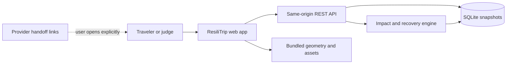
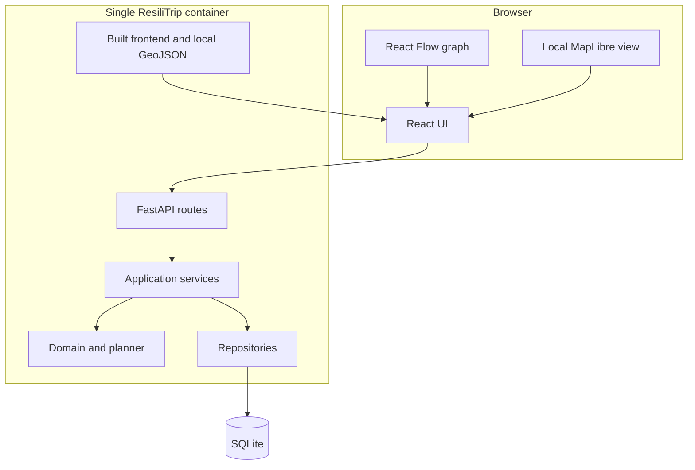

# ResiliTrip — Technical Architecture Specification

**Document:** 06 of the ResiliTrip implementation pack  
**Version:** 1.0  
**Date:** 6 September 2026  
**Status:** Proposed architecture baseline  
**Depends on:** Documents 01–05  
**Feeds:** API/Data Contracts, UX Specification, Test Strategy, implementation backlog and deployment runbook

## 1. Purpose

This document converts the locked ResiliTrip product, domain, fixture and algorithms into an implementable software architecture for a four-person hackathon team.

It fixes:

- deployable component boundaries;
- source-tree ownership;
- synchronous request and mutation flows;
- persistence representation and transaction rules;
- frontend state and rendering responsibilities;
- offline map/graph behavior;
- security and privacy boundaries;
- configuration, packaging and deployment;
- failure containment and observability;
- dependency policy and compatibility gates; and
- implementation sequencing.

This document does not redefine domain fields or endpoint payloads. Document 03 owns meanings, Document 04 owns canonical fixture values, Document 05 owns calculation behavior, and Document 07 will own exact serialized contracts.

## 2. Architecture drivers

| Driver ID | Requirement | Architectural response |
|---|---|---|
| ARC-G01 | Four people and a 24-hour build window | Modular monolith, one repository, one database, one deployable container |
| ARC-G02 | Generated rather than hardcoded alternatives | Backend planner reads atomic catalog records and invokes the shared evaluator |
| ARC-G03 | One authoritative truth | Every UI view consumes a versioned backend snapshot; frontend performs display formatting only |
| ARC-G04 | Deterministic and inspectable behavior | Pure domain functions, stable traversal, structured checks, canonical serialization and golden tests |
| ARC-G05 | Atomic event/adoption/reset | SQLite transactions, unique constraints, optimistic versions and one backend worker |
| ARC-G06 | Strong live demo | Full mutation responses, graph/map/table projections and locally available assets |
| ARC-G07 | Offline core | No provider API, geocoder, public tiles, model or remote asset needed for P0 |
| ARC-G08 | Honest India-specific prototype | Fictional Mumbai–Goa fixture, ₹/IST display and persistent simulation labels |
| ARC-G09 | Safe failure | Explicit no-plan/unknown/partial/stale/error states; no guessed fallback plan |
| ARC-G10 | Future replaceability | Repository and adapter boundaries around storage, fixture source, clock and optional map |

## 3. Architecture decision summary

| Layer | P0 decision | Deliberately excluded |
|---|---|---|
| Product shape | Local-first responsive web application | Native mobile application |
| Deployment | Single container and single backend process | Microservices, Kubernetes, queues |
| Frontend | React + TypeScript + Vite | Next.js/SSR migration, Redux |
| Styling | Plain CSS with tokens and component classes | New design-system dependency |
| Server state | Browser `fetch`, typed client and one app-level reducer | Duplicate client-side domain store |
| Dependency graph | `@xyflow/react`, deterministic positions | General auto-layout service |
| Map | MapLibre with bundled blank style and local GeoJSON | Public tile/geocoder dependency |
| Backend | Python + FastAPI + Pydantic | Agent framework, GraphQL |
| Backend execution | Synchronous FastAPI routes and SQLAlchemy sessions | Async database stack for P0 |
| Domain engine | Pure Python functions | Rules duplicated in endpoints or UI |
| DAG support | NetworkX for validation/topological utilities only | NetworkX path search as planner logic |
| Recovery search | Document 05 bounded custom DFS | CP-SAT, OpenTripPlanner, LLM planning |
| Persistence | SQLite, immutable JSON snapshots and indexed metadata | PostgreSQL/Redis for P0 |
| Updates | Request/response REST with full snapshots | WebSocket/SSE requirement |
| Packaging | Multi-stage image; frontend served by FastAPI | Two production services |
| Tests | pytest, Vitest, Playwright and contract fixtures | Unverified claims of correctness |

## 4. System context



No server-side connection to a railway, airline, hotel, map, payment or booking provider exists in P0. A provider handoff is an allowlisted browser link and is never treated as a completed action.

## 5. Deployable topology

### 5.1 Development

- Vite development server serves the frontend and proxies `/api` to FastAPI.
- Uvicorn runs one API worker.
- SQLite uses a workspace-local data file.
- Fixture and local geometry files are read from version-controlled paths.
- Frontend hot reload is development-only.

### 5.2 Demo and production-like run

- A Node build stage creates static frontend assets.
- A Python runtime image contains the API, migrations, fixture, local assets and built frontend.
- FastAPI serves `/api/*` and static files from the same origin.
- Uvicorn starts exactly one worker for the P0 SQLite transaction model.
- The application binds to `127.0.0.1` by default.
- A persistent volume is optional; reset can recreate the canonical demo state.

### 5.3 Why one process

One process removes distributed consistency, CORS, service discovery and deployment work while keeping the important module boundaries inside the code. It also makes the application’s in-process mutation guard valid. Multiple workers are prohibited until the storage/concurrency design is changed and tested.

## 6. Container architecture



The browser graph and map are alternative projections of the same snapshot. They do not feed facts back into the planner.

## 7. Repository layout

```text
resilitrip/
├── apps/
│   ├── api/
│   │   ├── resilitrip/
│   │   │   ├── api/                 # FastAPI routers, dependencies, error mapping
│   │   │   ├── application/         # Use cases and transaction orchestration
│   │   │   ├── domain/              # Immutable models, constraints, impact, planner
│   │   │   ├── infrastructure/      # SQLite repositories, clock, fixture loader
│   │   │   ├── telemetry/           # Safe structured application events
│   │   │   ├── config.py
│   │   │   └── main.py
│   │   ├── migrations/
│   │   ├── tests/
│   │   │   ├── unit/
│   │   │   ├── integration/
│   │   │   ├── contract/
│   │   │   └── golden/
│   │   └── pyproject.toml
│   └── web/
│       ├── src/
│       │   ├── api/                 # Generated types, client, response guards
│       │   ├── app/                 # Router, state machine, error boundary
│       │   ├── components/          # Shared presentation components
│       │   ├── features/            # setup, impact, recovery, adoption, reset
│       │   ├── graph/               # Snapshot-to-node projection only
│       │   ├── map/                 # Local geometry and animation adapter
│       │   ├── styles/
│       │   └── main.tsx
│       ├── public/assets/
│       ├── tests/
│       ├── package.json
│       └── vite.config.ts
├── data/
│   ├── fixtures/mumbai-goa-v2.json
│   └── geometry/mumbai-goa-v2.geojson
├── contracts/                       # Exported OpenAPI and generated TS artifacts
├── scripts/                         # bootstrap, seed, reset, test and demo commands
├── docs/                            # Approved product documents and runbook
├── Dockerfile
├── compose.yaml                     # Optional one-service convenience wrapper
├── .env.example
└── README.md
```

No module may import inward from an outer layer. Domain code cannot import FastAPI, SQLAlchemy, MapLibre or React types.

## 8. Backend dependency rule

Dependencies point inward:

```text
api → application → domain
api → infrastructure through application-owned ports
infrastructure → domain contracts
telemetry ← application events
```

### 8.1 Domain layer

Owns:

- immutable domain records and enums;
- structural/domain validation not tied to HTTP;
- shared constraint functions;
- impact evaluation and causal diff;
- bounded candidate enumeration;
- finance, classification, Pareto frontier and ranking;
- deterministic explanation facts and canonical signatures.

It must not open a database, read environment variables, make network calls, inspect wall-clock time directly or emit UI text beyond locked fallback templates.

### 8.2 Application layer

Owns use cases:

- load scenario/trip snapshot;
- create/update trip input;
- apply disruption event;
- calculate impact;
- generate/retrieve plans;
- change constraints;
- adopt plan;
- reset scenario;
- produce provider checklist;
- record safe analytics.

Application services obtain time through a `Clock` port and state through repository ports. They define transaction boundaries.

### 8.3 Infrastructure layer

Owns:

- SQLite schema and repository implementations;
- transaction context;
- canonical JSON persistence;
- fixture file loading;
- system/replay clock implementations;
- static asset loading;
- allowlisted provider-handoff configuration.

### 8.4 API layer

Owns:

- request parsing and response serialization;
- 256 KB request enforcement;
- expected-version header/body extraction;
- stable HTTP/problem mapping;
- same-origin static delivery;
- readiness and liveness endpoints.

Routes must not contain planning, money, cutoff or ranking formulas.

## 9. Concrete backend modules

| Module | Public responsibility | Key dependencies |
|---|---|---|
| `domain/models.py` | Immutable typed domain records | Pydantic/domain types only |
| `domain/reason_codes.py` | Stable reason and status enums | None |
| `domain/validation.py` | Cross-reference, chronology, DAG and bound validation | NetworkX DAG utilities |
| `domain/constraints.py` | Pure atomic checks/schedulers | Models, time/money helpers |
| `domain/impact.py` | Full itinerary schedule and before/after diff | Constraints |
| `domain/search.py` | Stable bounded DFS and SearchLabel | Constraints, models |
| `domain/finance.py` | Unique MoneyItems and exact paise totals | Models |
| `domain/frontier.py` | Deduplication, dominance and preset tuples | Models |
| `domain/explanations.py` | Structured explanation facts/templates | Reason codes |
| `application/events.py` | Idempotent event transaction | Repositories, impact |
| `application/plans.py` | Plan generation, persistence and retrieval | Search, evaluator, clock |
| `application/adoption.py` | Revalidation and internal adoption | Repositories, evaluator |
| `application/reset.py` | Monotonic versioned reset | Fixture loader, repositories |
| `infrastructure/sqlite.py` | Connection/session and write transaction | SQLite/SQLAlchemy |
| `infrastructure/repositories.py` | Repository implementations | SQLite models |
| `infrastructure/fixture_loader.py` | Parse/validate canonical manifest | Pydantic, domain validation |
| `api/routers/*.py` | Thin HTTP endpoints | Application use cases |

The shared full-plan evaluator is a single callable dependency of impact, recovery finalization and adoption. A second “fast” feasibility implementation is prohibited.

## 10. NetworkX boundary

NetworkX may be used for:

- duplicate-node/reference preparation after schema parsing;
- directed-acyclic-graph validation;
- stable topological ordering after explicit deterministic tie handling;
- shortest causal path, with lexicographic tie handling implemented around it.

NetworkX must not own:

- recovery candidate enumeration;
- time propagation semantics;
- location continuity;
- service cutoff logic;
- financial feasibility;
- plan ranking.

The custom search in Document 05 remains visible and testable. This resolves ALG-O05.

## 11. Request and snapshot model

### 11.1 Snapshot rule

Every successful state-changing response returns one complete authoritative `TripViewSnapshot` containing:

- trip and catalog versions;
- replay/current time;
- current state;
- effective itinerary;
- impact summary;
- constraints;
- relevant plans or plan-result reference;
- provenance labels;
- permitted next actions.

The UI replaces its prior server snapshot atomically. It never splices a plan from version 2 into an itinerary from version 3.

### 11.2 Read model

Application services project storage/domain records into a frontend-oriented read model. This projection may add labels, ordered collections and graph coordinates, but cannot recalculate feasibility.

### 11.3 Canonical serialization

For signatures, hashes and golden tests:

- UTF-8 JSON;
- sorted object keys;
- fixed enum strings;
- ISO 8601 instants with explicit offsets at the API boundary;
- normalized UTC instants internally where needed;
- integer paise only;
- no non-finite numbers;
- stable list order owned by the domain layer.

Document 07 will fix the exact serializer and schema fields.

## 12. Query flow

For a normal read:

1. Route validates the trip identifier.
2. Application service loads the current trip-version row and referenced catalog.
3. Repository verifies snapshot hashes and deserializes validated records.
4. Read-model projector creates one version-coherent view.
5. API serializes the response with a request correlation ID.

Read endpoints do not start write transactions or silently regenerate plans.

## 13. Disruption mutation flow

```mermaid
sequenceDiagram
    participant UI as Web UI
    participant API as Event route
    participant APP as Event service
    participant DB as SQLite
    participant ENG as Impact engine
    UI->>API: event + expected version
    API->>APP: validated command
    APP->>DB: BEGIN IMMEDIATE
    APP->>DB: check duplicate/conflict/version
    APP->>ENG: apply absolute event and recompute
    ENG-->>APP: next snapshot + impacts
    APP->>DB: append event/version; stale previews
    APP->>DB: COMMIT
    APP-->>UI: complete authoritative snapshot
```

The duplicate event-ID check precedes expected-version failure exactly as Document 05 requires. The transaction commits the event, new trip version and stale-plan state together or rolls back all of them.

## 14. Plan-generation flow

1. Validate request and expected trip version.
2. Load the trip and immutable catalog by version.
3. Commit no mutation yet; copy immutable inputs into memory.
4. Run CurrentState validation, impact evaluator and bounded enumerator.
5. Finalize, finance-check, classify, frontier-filter and rank candidates.
6. Build server-owned preview records and validity cutoffs.
7. Enter a short write transaction.
8. Recheck that the trip version/catalog version are unchanged.
9. If changed, discard results and return a version conflict.
10. Otherwise insert preview plans and a planner-run record atomically.
11. Return the complete planner result and matching snapshot metadata.

The computational search occurs outside the write lock. The second version check prevents stale calculated output from being stored as current.

## 15. Adoption flow

```mermaid
sequenceDiagram
    participant UI as Comparison UI
    participant API as Adoption route
    participant APP as Adoption service
    participant DB as SQLite
    participant ENG as Shared evaluator
    UI->>API: plan ID + version + acknowledgement
    API->>APP: validated command
    APP->>DB: BEGIN IMMEDIATE
    APP->>DB: load trip, catalog and server plan
    APP->>ENG: re-evaluate at replay clock
    ENG-->>APP: validity, totals and signature
    APP->>DB: append adoption/version; stale others
    APP->>DB: COMMIT
    APP-->>UI: adopted internal itinerary + checklist
```

No external provider call occurs inside or after the transaction. The response explicitly states `external_booking_executed=false`.

## 16. SQLite persistence model

### 16.1 Storage strategy

Validated domain snapshots are stored as canonical JSON plus indexed metadata. This avoids prematurely normalizing every activity subtype while retaining transactional and uniqueness guarantees.

| Table | Essential columns | Primary/unique constraints |
|---|---|---|
| `catalogs` | catalog version, scenario ID, canonical JSON, hash, created time | catalog version unique and immutable |
| `trips` | trip ID, current version, catalog version, scenario ID, created/updated time | trip ID primary key |
| `trip_versions` | trip ID, version, canonical snapshot JSON, hash, mutation kind, created time | `(trip_id, version)` unique |
| `events` | trip ID, event ID, source ID/sequence, expected/applied version, payload JSON/hash, disposition, created time | `(trip_id,event_id)` and `(trip_id,source_id,source_sequence)` unique |
| `planner_runs` | run ID, trip/catalog versions, preset, scope JSON, complete flag, counts, elapsed ms, created time | run ID primary key |
| `plans` | trip ID, plan ID, trip/catalog versions, status, sequence signature, plan JSON/hash, valid-until, created time | `(trip_id, plan_id)` unique; sequence signature indexed |
| `planner_run_plans` | run ID, trip ID, plan ID, result bucket, display rank, ranking reason | `(run_id, trip_id, plan_id)` unique |
| `adoptions` | adoption ID, trip ID, prior/new version, plan ID, acknowledgement, external-executed flag, created time | adoption ID unique; `(trip_id,plan_id)` at most one successful adoption |
| `telemetry_events` | local event ID, event type, safe properties JSON, created time | event ID primary key |
| `schema_migrations` | revision, applied time | revision unique |

### 16.2 Foreign keys

- `trip_versions.trip_id → trips.trip_id`;
- `trips.catalog_version → catalogs.catalog_version`;
- `events.trip_id → trips.trip_id`;
- `planner_runs.trip_id/version → trip_versions`;
- `planner_run_plans.run_id → planner_runs.run_id`;
- `planner_run_plans.(trip_id,plan_id) → plans.(trip_id,plan_id)`;
- `adoptions.(trip_id,plan_id) → plans.(trip_id,plan_id)`.

Enable `PRAGMA foreign_keys=ON` on every connection.

### 16.3 JSON integrity

On write:

1. validate the Pydantic/domain record;
2. canonicalize once;
3. hash canonical bytes;
4. store JSON and hash in the same transaction.

On read, a hash mismatch is an internal data-integrity error. The application must not continue planning from corrupted content.

### 16.4 Database modes

- Enable WAL mode during database initialization.
- Use a bounded busy timeout.
- Use `BEGIN IMMEDIATE` for event, constraint, adoption and reset mutations.
- Use short transactions; planner search runs outside a write transaction.
- Run one Uvicorn worker.
- Use synchronous SQLAlchemy sessions and synchronous FastAPI route functions for database-backed P0 use cases.
- Never share ORM sessions across requests or threads.

WAL improves local read/write behavior but is not permission to run several application workers.

## 17. Repository interfaces

Application code depends on ports resembling:

```text
TripRepository
  get_current(trip_id)
  append_version(expected_version, snapshot, mutation_kind)

CatalogRepository
  get(version)
  insert_immutable(catalog)

EventRepository
  find_by_event_id(trip_id, event_id)
  find_latest_source_sequence(trip_id, source_id)
  append(event_record)

PlanRepository
  save_run_and_plans(run, plans)
  get_server_plan(trip_id, plan_id)
  mark_trip_previews_stale(trip_id, except_run_id?)

AdoptionRepository
  append(adoption)
```

Exact Python protocols belong in implementation. Repositories return domain/application records rather than ORM models to outer layers.

## 18. Transaction and concurrency rules

| Operation | Transaction rule | Conflict behavior |
|---|---|---|
| Load/read | Consistent read session | 404 if absent |
| Apply event | One immediate write transaction | duplicate, event-ID conflict, sequence stale or version conflict |
| Edit constraints/input | One immediate write transaction | expected-version conflict |
| Generate plans | Compute outside lock; short compare-and-save transaction | discard on version/catalog change |
| Adopt | One immediate write transaction with full revalidation | stale/expired/ineligible/version conflict |
| Reset | One immediate write transaction | expected-version conflict |

The process uses one application-level mutation mutex as a defensive simplification for the demo. Database constraints and expected versions remain authoritative, so tests must not depend solely on the mutex.

## 19. Clock architecture

All domain/application functions receive time explicitly.

Two implementations exist:

- `ReplayClock`: authoritative for the canonical scenario and perturbation tests;
- `SystemClock`: optional for manual fictional trips.

The hero uses `ReplayClock`. Advancing the demo clock is a versioned action because it can expire plans. Browser time, animation time and database creation time cannot decide domain validity.

Persist:

- domain replay instant in the trip snapshot;
- UTC audit creation timestamp separately;
- display timezone as `Asia/Kolkata`/explicit offset information per Document 03.

## 20. Frontend architecture

### 20.1 State ownership

The frontend stores:

- latest complete server snapshot;
- request state and safe error;
- currently selected activity/plan;
- display preset requested by the user;
- reduced-motion and view preferences;
- transient form draft before submission.

It does not store authoritative derived slack, money, eligibility, ranks or effective service times separately.

### 20.2 App state machine

```text
booting → ready
ready → mutating → complete | conflict | error
ready → planning → complete | no_plan | needs_input | partial | error
complete → adopting → adopted | stale | error
any recoverable state → resetting → ready | error
```

Buttons are disabled only for the mutation they would duplicate. Read-only exploration of the last complete snapshot may remain visible during loading, with a clear updating indicator.

### 20.3 Data access

- Use one typed `apiClient` around browser `fetch`.
- Use generated request/response TypeScript types from OpenAPI.
- Reject/flag a response whose trip/catalog versions contradict its envelope.
- Use `AbortController` for superseded reads.
- Do not automatically retry mutations; allow explicit safe retry with the same event ID.
- Map HTTP problem codes to the explicit PRD UI states.

### 20.4 Component boundaries

| Feature | Components | Input |
|---|---|---|
| Setup/review | trip form, assumption review, source badges | snapshot/draft schema |
| Impact | disruption control, timeline, dependency graph, impact drawer | server impact projection |
| Recovery | plan cards, Pareto comparison table, reason drawer, preset tabs | planner result |
| Map | local route layer, mode markers, optional animation | display geometry plus selected plan |
| Adoption | acknowledgement modal, checklist, internal status | server-owned plan/adoption response |
| Failure | no-plan, needs-input, partial, stale, offline/error panels | stable problem/result code |
| Reset | reset confirmation and result banner | reset response |

### 20.5 Error boundary

A top-level React error boundary preserves a restart/reset action. Component errors must not be presented as “no feasible plan.” Domain result states and software failures are visually and semantically different.

## 21. Dependency graph view

`@xyflow/react` receives pre-ordered nodes and deterministic positions from a frontend projection function. The layout is intentionally small and scenario-specific enough for the demo.

Node content includes:

- mode/activity label;
- scheduled/effective time;
- status text and accessible icon;
- source class;
- short impact or rejection marker.

Edges show dependencies and causal highlighting. They do not carry travel duration when movement already exists as an activity.

Graph requirements:

- rectangular information nodes, not unexplained circles;
- keyboard-selectable nodes;
- text status in addition to color;
- fit-to-view control;
- stable node locations before/after D1 to make changes understandable;
- non-graph itinerary table containing the same essential facts.

## 22. India-specific local map architecture

### 22.1 Data

Bundle a small GeoJSON file containing illustrative coordinates and paths for:

- Mumbai CSMT;
- Mumbai airport terminal location;
- Goa airport locations used by the fixture;
- fictional hotel and wedding venue display points;
- plan-specific rail/air/road line strings.

Each feature carries `scenario_id`, `location_id` or `plan_id`, `mode`, and `source_class=synthetic_display_geometry`.

### 22.2 Rendering

MapLibre starts with a bundled blank/light style and no remote tile source. Local GeoJSON layers render:

- rail, air and road segments with distinct line styles;
- labeled stops;
- mode icons stored locally;
- selected-plan emphasis;
- optional plane/train/cab marker interpolation.

Animation is cosmetic. Its clock never changes replay time, plan validity or arrival calculations. Reduced-motion mode replaces movement with static highlighting.

### 22.3 Failure fallback

If WebGL or map initialization fails:

- hide only the map canvas;
- show a local schematic route strip;
- keep graph, itinerary table and all actions usable;
- emit a safe `ui_error` event.

The map must never be the only way to learn a location, time, status or plan sequence.

## 23. Static asset and offline policy

The following must be bundled in the built frontend/container:

- JavaScript/CSS bundles;
- fonts or system-font fallbacks;
- mode/status icons;
- canonical fixture;
- local GeoJSON;
- truth/source labels;
- provider-checklist text.

No runtime CDN import is permitted. The offline acceptance test disables the network after launch and completes load → D1 → compare → adopt/reset.

## 24. API boundary responsibilities

Document 07 will define exact routes and schemas. Architecture reserves these resource groups:

| Resource group | Responsibility |
|---|---|
| `/api/health/*` | liveness/readiness only |
| `/api/scenarios` | list/load approved fixture scenarios |
| `/api/trips` | create/read/update fictional trip and current state |
| `/api/trips/{id}/events` | apply supported disruption/clock events |
| `/api/trips/{id}/plans` | generate/read planner runs and previews |
| `/api/trips/{id}/adoptions` | internally adopt one eligible plan |
| `/api/trips/{id}/reset` | restore canonical content as a new version |

Every mutating command supplies an idempotency/domain command ID where appropriate and an expected trip version. Errors use stable machine codes plus safe human guidance.

## 25. Error containment

| Failure | Containment | User state |
|---|---|---|
| Schema/domain validation | Reject before engine/storage mutation | needs input |
| Duplicate event retry | Return prior disposition/current snapshot | ready/complete |
| Version conflict | No write; fetch latest snapshot | stale/conflict |
| Unknown required fact | Preserve unknown checks; no certification | needs input |
| No feasible bounded path | Keep rejection evidence | no feasible catalog plan |
| Runtime guard | Preserve partial diagnostics; disable adoption | partial search |
| DB write failure | Roll back complete mutation | retryable/non-retryable error |
| Corrupt stored hash | Stop use of affected trip | internal data error/reset guidance |
| Map/WebGL failure | Preserve core UI | map unavailable |
| Unexpected UI exception | Error boundary | software error, reset/reload |

No catch-all handler may convert an exception into an empty feasible-plan list.

## 26. Security and privacy architecture

### 26.1 P0 local-demo controls

- Accept fictional data only and state this in the UI.
- Do not request/store PNR, Aadhaar, passport, payment, email or precise live tracking.
- Bind to localhost by default.
- Allow only exact local development origins when Vite runs separately.
- Limit JSON request bodies to 256 KB before parsing.
- Forbid unknown schema fields and enforce domain collection bounds.
- Escape labels through normal React rendering; do not inject HTML.
- Do not server-fetch user-provided URLs.
- Open only configured provider domains through explicit user action.
- Keep secrets out of frontend bundles, fixture, logs and repository.
- Redact arbitrary input from errors and telemetry.
- Reset/delete operations resolve one explicit trip ID; no broad filesystem deletion.

### 26.2 Authentication decision

P0 localhost demo has no account/authentication system because it stores only controlled fictional data. The API is not approved for LAN/public exposure.

Before any public or real-user deployment, require a separate architecture revision covering authentication, authorization per trip, TLS, CSRF/cookie decisions, rate limiting, retention/deletion including backups, privacy notices, incident response and applicable Indian data-protection review.

### 26.3 Browser security headers

The production-like server should set:

- a restrictive Content Security Policy compatible with bundled assets and WebGL;
- `X-Content-Type-Options: nosniff`;
- a conservative referrer policy;
- framing denial unless an intentional demo embed is approved.

Exact header values are verified after the final frontend asset graph is known.

## 27. Configuration

| Setting | Default | Rule |
|---|---|---|
| `RESILITRIP_MODE` | `demo` | `demo` is the only P0 approved mode |
| `RESILITRIP_BIND_HOST` | `127.0.0.1` | Public bind requires explicit architecture change |
| `RESILITRIP_PORT` | `8000` | May change without domain effect |
| `RESILITRIP_DB_PATH` | explicit app-data path | Never derive a destructive target from an empty variable |
| `RESILITRIP_SCENARIO_ID` | `mumbai-goa-v2` | Must resolve an approved fixture |
| `RESILITRIP_SEARCH_GUARD_MS` | `750` | Produces partial status on exhaustion; validate on demo laptop |
| `RESILITRIP_REQUEST_LIMIT_BYTES` | `262144` | Hard maximum for JSON requests |
| `RESILITRIP_LOG_LEVEL` | `INFO` | Never enables raw payload logging |
| `RESILITRIP_TELEMETRY` | `local` | No third-party exporter in P0 |

The 750 ms guard resolves ALG-O01 as an initial configuration. It is not a performance claim; Gate 2 testing may raise it if the declared bounded fixture cannot exhaust safely, but a changed value must be recorded.

## 28. Dependency and runtime policy

### 28.1 Runtime baseline

| Runtime | Chosen line | Reason |
|---|---|---|
| Python | CPython 3.12.x | Broad current library compatibility and stable typing/runtime behavior |
| Node.js | Node 22 LTS | Stable build runtime; not required in final runtime image |
| Browser | Current Chromium-based judge/demo browser; Firefox smoke test if time permits | WebGL and presentation target |
| SQLite | Version shipped with the selected Python image, recorded at build | Single-file transactional store |

The team must not use the user laptop’s Python 3.14 environment for this project unless the complete locked dependency test passes. Use a dedicated Python 3.12 environment or the container.

### 28.2 Direct dependency families

| Area | Required major line | Lock requirement |
|---|---|---|
| FastAPI | 0.x compatible with Pydantic 2 | exact version in Python lockfile |
| Pydantic | 2.x | exact version in Python lockfile |
| SQLAlchemy | 2.x | exact version in Python lockfile |
| Alembic | 1.x compatible with selected SQLAlchemy | exact version in Python lockfile |
| NetworkX | 3.x | exact version in Python lockfile |
| Uvicorn | compatible stable line | exact version in Python lockfile |
| pytest | compatible stable line | dev lock group |
| React / React DOM | 19.x | exact version in npm lockfile |
| TypeScript | 5.x | exact version in npm lockfile |
| Vite | line compatible with Node 22 and React 19 | exact version in npm lockfile |
| `@xyflow/react` | 12.x | exact version in npm lockfile |
| `maplibre-gl` | 5.x | exact version in npm lockfile |
| Vitest | line compatible with selected Vite | exact version in npm lockfile |
| Playwright | compatible stable line | exact version plus installed browser revision |

These are API compatibility lines, not claims that a particular combination has been tested. The first implementation action is a clean compatibility trial that produces exact lockfiles, imports every direct dependency, renders graph/map smoke pages, opens SQLite with foreign keys/WAL, runs one FastAPI request, and builds the container. The successful exact versions are recorded in this table’s implementation addendum without changing the architecture.

Python dependency management uses `pyproject.toml` plus `uv.lock`; frontend dependency management uses `package.json` plus `package-lock.json`. The tested `uv`, npm and container-engine versions are recorded in the build runbook. CI and local builds use frozen/locked installation modes after Gate A0 succeeds.

### 28.3 Dependency stop rule

If MapLibre or React Flow blocks the clean build for more than 30 minutes:

- replace the map with the local schematic route strip; or
- replace the interactive graph with accessible positioned HTML cards and SVG edges.

Do not change the backend, fixture or domain logic to accommodate a visualization dependency.

## 29. Build and launch workflow

### 29.1 Required commands

The repository must expose documented commands for:

- bootstrap Python and Node dependencies;
- validate and seed the canonical fixture;
- run backend unit/integration tests;
- run frontend unit tests;
- run contract generation/check;
- run Playwright hero flow;
- start development mode;
- build the production-like container;
- start the offline demo;
- reset only the canonical demo trip;
- benchmark 100 warmed searches.

The final command names may be Make targets plus equivalent PowerShell scripts so the Windows demo laptop does not depend on a Unix shell.

### 29.2 Startup

1. Validate configuration and safe database path.
2. Open SQLite and enable required pragmas.
3. Apply forward migrations.
4. Validate the fixture from bytes.
5. Seed the immutable catalog if absent.
6. Create/reset the demo trip only when explicitly requested or absent.
7. Mark readiness healthy.
8. Serve API and frontend.

A malformed fixture or failed migration keeps readiness unhealthy and produces an actionable startup error.

## 30. Health and observability

### 30.1 Health endpoints

- Liveness: process and event loop/threadpool can answer.
- Readiness: database query succeeds, schema revision matches and canonical fixture/catalog can be resolved.

Planner success is not tested on every health request.

### 30.2 Structured application log

Each request receives a correlation ID. Allowed fields include:

- route and method;
- safe result/error code;
- trip/catalog version, not traveler name;
- event disposition;
- planner counts and completeness;
- duration milliseconds;
- adoption revalidation result.

Never log full request/response bodies, booking references, free text or provider URLs.

### 30.3 Local telemetry

Implement PRD analytics as append-only local records. Telemetry failure must not fail a valid trip mutation; emit a safe application log and continue. A demo-only diagnostics panel may display counts and search duration but cannot expose sensitive payloads.

## 31. Performance architecture

- Load the small immutable catalog once per process after validation; address it by version.
- Keep domain models immutable so a request cannot alter the cache.
- Recompute the active itinerary rather than maintaining fragile incremental caches.
- Build origin indexes once per planner invocation or catalog cache entry.
- Perform DFS in memory.
- Persist only finalized plans, representative rejection details and aggregate prune counts.
- Do not serialize ORM objects lazily after their session closes.

Benchmark the complete impact + search application call, excluding frontend animation and including domain serialization. Record CPU, RAM, OS/container, Python version, catalog size, search limits, p50/p95/max and complete/partial counts.

## 32. Recovery and data lifecycle

### 32.1 Reset

Reset creates a new version from the immutable baseline. It does not delete trip history or reuse prior plan IDs as valid previews.

### 32.2 Backup for the hackathon

Before judging:

- retain the repository and lockfiles;
- retain the canonical fixture and migration files;
- keep a clean seeded database copy only if permitted;
- record a backup demo video;
- test reset from the running UI five times.

The application must also be able to recreate the database from migrations and fixture, so the copied DB is not the sole recovery path.

### 32.3 Schema migration

Use forward-only numbered migrations during the hackathon. Any destructive migration requires a fresh demo database rather than ad hoc editing. Fixture/schema incompatibility fails at startup with an explicit expected/actual version.

## 33. Testing seams

| Seam | Test substitution |
|---|---|
| Clock | Fixed ReplayClock |
| Repository ports | In-memory unit doubles; real SQLite integration |
| Fixture source | Minimal valid/invalid manifests |
| Runtime guard | Deterministic counter/cancellation probe where possible |
| Provider handoff | Allowlist validator without opening browser |
| Map | Local GeoJSON and forced WebGL failure |
| API client | Recorded typed responses and real end-to-end server |

The shared evaluator is not mocked in planner or adoption integration tests. Those tests must exercise the same actual domain rules.

## 34. Four-person ownership

| Role | Primary code ownership | Mandatory reviewer/backstop |
|---|---|---|
| A — Domain/impact | models, validation, constraints, impact, time tests | Reviews B’s full evaluator use; D backstops fixture parsing |
| B — Planner/finance | search, finance, frontier, ranking, planner tests | Reviews A’s cutoff/location cases |
| C — Product/UI | app state, graph, table, map, comparison and accessibility | D backstops API integration; A verifies displayed reason facts |
| D — API/integration | application use cases, repositories, transactions, fixtures, packaging | A reviews event state; B reviews plan/money persistence |

### 34.1 Anti-bottleneck pairing

- A and B jointly own `evaluate_full_plan`; neither may change its contract alone.
- B and D jointly verify persisted plan signatures/totals.
- C and D establish one typed snapshot before adding animation.
- A can run/diagnose fixture and event tests if D is blocked.
- D can wire a plain HTML fallback if C’s graph/map libraries block integration.

No person owns the entire credibility pillar alone.

## 35. Implementation sequence and integration gates

| Gate | Required output | Integration proof |
|---|---|---|
| A0 — Compatibility | clean runtime, locks, dependency smoke test, container skeleton | fresh checkout build |
| A1 — Persistence/schema | migrations, fixture loader, repository tests | load/reset version 1 |
| A2 — Headless domain | evaluator, D1, F2/F3/F4/wait and finance | canonical golden suite |
| A3 — Mutations | event, constraint, adoption and reset transactions | duplicate/stale/rollback tests |
| A4 — Typed API | OpenAPI, generated TS client, error mapping | contract check has no diff |
| A5 — Core UI | setup, impact graph/table, comparison, rejection | browser uses real snapshots |
| A6 — Demo UI | local map/animation and provider checklist | network-disabled hero flow |
| A7 — Release | performance record, five runs, backup video/runbook | Gate 4 PRD checklist |

Parallel work begins only after A1 supplies validated model/fixture contracts. C may build presentation components against the exact canonical fixture shape, but must switch to generated API types at A4.

## 36. Architecture acceptance criteria

| ARC ID | Criterion | Evidence |
|---|---|---|
| ARC-01 | One command launches the production-like app | clean-machine/container run |
| ARC-02 | Core hero completes with network disabled | Playwright/offline rehearsal |
| ARC-03 | Frontend never calculates authoritative slack/money/eligibility | code review and mutation test |
| ARC-04 | Impact/planner/adoption import the same evaluator | dependency/unit test |
| ARC-05 | Plans arise from atomic catalog traversal | sequence/golden tests |
| ARC-06 | Event/adoption/reset are all-or-nothing | injected-failure integration tests |
| ARC-07 | Duplicate/stale commands cannot create extra versions | concurrency/idempotency tests |
| ARC-08 | Plan generation rechecks version before persistence | race integration test |
| ARC-09 | One snapshot never mixes trip/catalog/plan versions | contract and UI response guard tests |
| ARC-10 | NetworkX cannot decide recovery paths or feasibility | import/module review |
| ARC-11 | Local map failure cannot block recovery use | forced failure E2E test |
| ARC-12 | Animation never changes domain state | UI/domain isolation test |
| ARC-13 | Request size, strict schema and bounds are enforced | API safety tests |
| ARC-14 | Logs/telemetry omit prohibited data | captured-log tests |
| ARC-15 | Stored snapshots are canonical and hash-checked | repository corruption test |
| ARC-16 | Runtime guard produces partial, never false no-plan | planner/API test |
| ARC-17 | Exact dependencies and runtime versions are locked after a clean trial | committed lockfiles/build record |
| ARC-18 | Windows demo laptop has a documented non-Unix launch route | PowerShell/container rehearsal |
| ARC-19 | Reset recovers canonical content with a higher version | integration/E2E test |
| ARC-20 | All PRD UI states map to distinct result/problem codes | Document 07 traceability test |

## 37. Requirement traceability

| Architecture area | PRD/NFR | Algorithm/fixture evidence |
|---|---|---|
| Versioned snapshots and REST full responses | NFR-01, NFR-06, FR-031–FR-034 | ALG-13, ALG-17; FX-12–FX-15 |
| Immediate SQLite transactions | NFR-07, NFR-10 | ALG-01, ALG-14–ALG-16; FX-10, FX-12–FX-14 |
| Shared pure evaluator | FR-011–FR-020, NFR-11 | ALG-03–ALG-08 |
| Server-owned finance and plans | FR-021–FR-030 | ALG-09–ALG-16; F2/F3 ledgers |
| Offline bundled UI | FR-007, FR-033, NFR-04 | T18 and local GeoJSON |
| Accessible graph/map alternatives | NFR-05 | graph plus itinerary table and reduced motion |
| Input/privacy controls | NFR-08, NFR-09 | strict P0 schema and local fictional mode |
| Reproducible single-container build | NFR-12 | ARC-01, ARC-17–ARC-18 |

## 38. Decisions fixed by this specification

| Decision ID | Resolution |
|---|---|
| ARCH-D01 | Build a modular monolith and one production container |
| ARCH-D02 | Serve frontend and API from the same origin in demo mode |
| ARCH-D03 | Use synchronous REST full-snapshot updates; no socket dependency |
| ARCH-D04 | Store immutable canonical JSON snapshots plus indexed relational metadata |
| ARCH-D05 | Use SQLite immediate write transactions, WAL and one API worker |
| ARCH-D06 | Run plan search outside the write lock and recheck version before save |
| ARCH-D07 | Use NetworkX only for DAG/topology/causal utilities |
| ARCH-D08 | Use a custom bounded planner and one shared full evaluator |
| ARCH-D09 | Use a backend ReplayClock for the canonical demo |
| ARCH-D10 | Keep frontend authoritative state as one replaceable versioned snapshot |
| ARCH-D11 | Bundle a blank MapLibre style and synthetic local India corridor GeoJSON |
| ARCH-D12 | Treat all movement animation as non-authoritative presentation |
| ARCH-D13 | Use no authentication only for localhost fictional P0 |
| ARCH-D14 | Choose Python 3.12 and Node 22 runtime lines; lock exact dependencies after a clean trial |
| ARCH-D15 | Start with a 750 ms configurable runtime guard and preserve partial-search truth |

## 39. Open items for later documents

| Open ID | Owner document | Required decision |
|---|---|---|
| ARCH-O01 | Document 07 — API/Data Contracts | Exact routes, field names, status codes, error envelope, canonical serializer and OpenAPI generation command |
| ARCH-O02 | UX Specification | Responsive layouts, component states, copy and deterministic graph coordinates |
| ARCH-O03 | Test Strategy | Exact fixture/property/concurrency/E2E cases and coverage gates |
| ARCH-O04 | Implementation kickoff | Exact dependency versions proven by compatibility trial and recorded build environment |
| ARCH-O05 | Deployment Runbook | Windows/Docker commands, database path, offline rehearsal and backup steps |
| ARCH-O06 | Organizer confirmation | Whether pre-event scaffolding/dependency work is permitted |

Open items may refine implementation mechanics but cannot introduce provider dependencies, real booking, guessed facts or client-owned calculations into P0.

## 40. Architecture risks and fallbacks

| Risk | Early signal | Required fallback |
|---|---|---|
| React Flow integration consumes domain time | UI creates its own feasibility values | restrict graph adapter to server fields and static positions |
| Map/WebGL fails on judge device | smoke page fails or network request appears | schematic route strip; remove animation before core features |
| SQLite locking appears | busy/locked error in race test | confirm one worker, short transactions and mutation guard; do not add Redis |
| Search exceeds guard | any hero partial result | profile bounds/duplicates; raise recorded guard only after correctness review |
| Contract drift | generated TS diff or runtime mismatch | block merge until OpenAPI/client regenerated |
| Dependency incompatibility | clean trial fails | use selected runtime/container; remove optional visualization library first |
| One specialist blocks progress | critical module has no reviewer | use pairing/backstop rules in §34.1 |
| Demo data looks live | missing label or moving marker misunderstood | persistent synthetic/replay badge and explicit animation legend |

## 41. Approval

This architecture is ready to lock when:

- A confirms the domain layer can remain framework-independent;
- B confirms the custom planner and full evaluator boundaries preserve Document 05;
- C confirms the graph/map/table can render solely from versioned server data;
- D confirms transactions, repositories and single-container packaging are implementable;
- the team accepts the single-worker/local-fictional deployment boundary; and
- the compatibility trial is scheduled as implementation Gate A0.

| Role | Name | Approval | Date |
|---|---|---|---|
| A — Domain/impact |  | Pending |  |
| B — Planner/finance |  | Pending |  |
| C — Product/UI |  | Pending |  |
| D — API/integration |  | Pending |  |

After approval, create **Document 07 — API and Data Contract Specification**. It must turn Documents 03–06 into exact Pydantic/OpenAPI/TypeScript contracts without moving domain calculations into transport schemas or the frontend.
