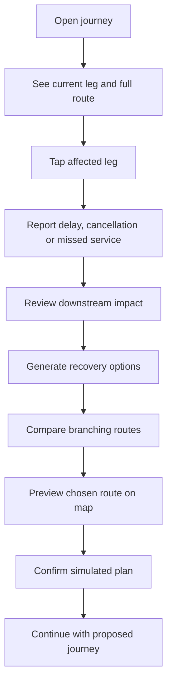

# ResiliTrip — UX, Interaction and Demo Specification

**Document:** 08 of the ResiliTrip implementation pack  
**Version:** 1.0  
**Date:** 6 September 2026  
**Status:** Proposed AI-facing UX baseline  
**Depends on:** Documents 01–07  
**Feeds:** Frontend implementation, end-to-end tests and demo rehearsal  
**Execution model:** One Codex account; no task or person assignments

## 1. Purpose

This document defines the complete P0 user experience for ResiliTrip. It tells an implementation AI what the product should look like, how every interaction behaves, which API fields drive each view, and how the hackathon demo should unfold.

The experience must feel like a familiar consumer travel app, not a transport-operations console or graph-analysis tool. Technical IDs, database versions, search counts and constraint codes remain hidden in the normal flow unless a developer diagnostics mode is intentionally enabled.

## 2. Locked UX decisions

| Decision | Locked choice |
|---|---|
| Primary experience | Map-first journey workspace |
| Recovery visualization | Consumer-friendly branching routes |
| Disruption entry | Tap a journey leg, then choose “Report a problem” |
| Editing | Any future item may be selected for change/removal; safeguards depend on item type |
| Target | Desktop/laptop-first, fully responsive on mobile |
| Visual personality | Friendly, calm consumer travel app |
| Technical appearance | Avoid raw graph/database/algorithm terminology |
| Authority | Backend snapshot owns times, costs, status, rank and feasibility |
| Demo truth | Persistent synthetic/not-bookable disclosure |

## 3. Experience promise

Within ten seconds of opening the loaded journey, a normal user should understand:

1. where they are now;
2. what they are doing or taking next;
3. the remaining journey and important commitments;
4. whether the journey is still safe;
5. how to report a disruption; and
6. where to compare recovery choices.

After a disruption, the user should understand the best available options without needing to interpret a technical dependency graph.

## 4. Design principles

| Principle | Required behavior |
|---|---|
| Journey first | Start with the traveler’s route and current situation, not forms or analytics |
| Progressive disclosure | Show the essential answer first; place policy, source and constraint evidence in expandable detail |
| Plain language | Say “You’ll reach the wedding 50 minutes late,” not `HARD_DEADLINE_MISSED` |
| Calm urgency | Use clear red/amber warnings without alarmist flashing or countdown pressure |
| Choice without overload | Show at most three feasible branches and collapse rejected alternatives |
| Honest confidence | Unknown information stays visibly unknown; never display invented percentages |
| Safe editing | Let users initiate changes while clearly explaining what is locked, risky or invalid |
| Accessible equivalence | Map, route branches and motion always have table/list alternatives |
| Snapshot consistency | Map, timeline, cards and details always show the same trip/catalog version |

## 5. Primary user flow

Editing the remaining journey is available from the workspace and recovery view, but it must not interrupt the main disruption-to-recovery path.

## 6. Information architecture

The product uses one main route after setup:

| Route/view | Purpose |
|---|---|
| `/` | Load the demo or create a manual journey |
| `/trip/:tripId` | Map-first journey workspace |
| `/trip/:tripId/recovery` | Branching recovery comparison; may appear as an expanded workspace state |
| `/trip/:tripId/plan/:planId` | Plan detail and map preview |

Adoption, disruption reporting, activity detail, editing and reset use sheets/modals inside these routes. They do not require separate pages.

Browser refresh must recover the current trip using the URL and `GET /api/v1/trips/{trip_id}`. Selection and open-sheet state may reset; authoritative journey state must not.

## 7. Global application shell

### 7.1 Header

Desktop header height: 64–72 px. It contains:

- ResiliTrip wordmark;
- compact route title, such as “Mumbai → Goa”;
- journey date;
- a clearly visible `Simulated trip` chip;
- overflow menu containing Edit journey, Reset scenario and About this demo.

Do not place developer version numbers in the main header. A stale/conflict state may show “Journey updated” rather than “Version 3 conflict.”

### 7.2 Persistent truth strip

Directly below the header, display a slim, non-dismissible strip:

> Synthetic travel scenario · Options are not live or bookable

The exact API `truth_label` remains available to screen readers and About details. The friendlier sentence may be used visually as long as it preserves the same meaning.

### 7.3 Toast region

Toasts appear at the top-right on desktop and above the bottom navigation/safe area on mobile. Use them for transient confirmation only:

- “Disruption added. Your journey has been recalculated.”
- “This plan is out of date. We’ve refreshed your journey.”
- “Scenario reset.”

Critical explanations remain in-page and are never toast-only.

## 8. Setup and trip loading

### 8.1 Default demo landing

The first screen should make the hero scenario one obvious action:

- Title: “Stay on track when plans change”
- Supporting text: “See how one disruption affects your whole journey and compare practical ways forward.”
- Primary button: “Try Mumbai to Goa demo”
- Secondary button: “Enter a journey manually”
- Small disclosure: “Uses fictional schedules, fares and availability.”

Avoid a technical scenario selector as the dominant element. If multiple fixtures exist later, show consumer-style journey cards.

### 8.2 Manual journey

Manual entry uses a guided sequence:

1. route and current position;
2. transport legs and transfers;
3. stays and important events;
4. budget and travel preferences;
5. review.

Show field-level errors near the input, preserve entered data, and scroll/focus the first invalid field. Raw JSON is developer-only and not part of normal UX.

### 8.3 Loading

On first load, show a lightweight route skeleton rather than a full-screen spinner. Use the label “Preparing your journey…” and preserve the truth strip.

## 9. Desktop journey workspace

Desktop layout at widths ≥1024 px:

| Region | Width/position | Content |
|---|---|---|
| Header/truth strip | Full width | Identity, route, simulation disclosure |
| Map canvas | Approximately 62–68% of content width | Entire remaining route, current marker, transport legs and events |
| Journey panel | Approximately 32–38%, right side | Current status, ordered timeline, impact/recovery actions |
| Context sheet | Overlays right panel or bottom of map | Activity, disruption, plan or evidence detail |

The map remains visible during normal timeline selection, disruption reporting, recovery preview and adoption. It may shrink when the branching-route comparison opens, but it should not disappear unless space requires it.

Minimum desktop content width is 960 px. Above 1440 px, cap readable panel width and allow the map to absorb additional space.

## 10. Responsive behavior

| Width | Layout |
|---|---|
| ≥1280 px | Large map plus fixed 420–480 px journey panel |
| 1024–1279 px | Map plus 360–420 px panel |
| 768–1023 px | Map top 52–58vh; timeline and actions below |
| <768 px | Full-width map top 38–44vh; draggable bottom sheet for journey/recovery |

Mobile uses a bottom navigation with at most three destinations: Journey, Options and Details. Do not reproduce a desktop sidebar as a narrow drawer.

All primary actions remain reachable without hover. Sheets respect device safe areas and do not cover the current-location marker without a “fit route” control.

## 11. Map experience

### 11.1 What the map must show

- entire active journey, not only the current leg;
- current traveler location or current service position;
- completed route in muted styling;
- current/next leg with strongest emphasis;
- remaining transport and activity stops;
- hotel and hard-event markers;
- selected recovery plan when previewing;
- route legend using icons plus labels.

### 11.2 Marker behavior

Use recognizable local icons:

- train for rail service;
- plane for air service;
- car for road transfer;
- building/bed for hotel;
- calendar/star for important event;
- filled location pin with “You are here” label for current state.

Markers have 40–44 px pointer targets. Selecting a marker selects the same item in the journey list and opens its detail card.

### 11.3 Route styling

| State/mode | Treatment |
|---|---|
| Completed | Muted gray solid line |
| Current | Primary blue, 4–5 px, subtle direction cue |
| Future rail | Purple line plus train icon |
| Future air | Blue line plus plane icon; gentle arc |
| Future road | Teal line plus car icon |
| Disrupted | Red line with interruption marker; no rapid animation |
| Unselected alternative | Low-opacity colored line |
| Selected alternative | Full opacity with soft outer glow |
| Rejected alternative | Gray/red dashed preview only when opened |

Color never carries meaning alone; tooltips/list labels repeat the state.

### 11.4 Map controls

Keep controls minimal:

- Fit journey
- Center on me/current service
- Zoom in/out
- Motion on/off where allowed

Do not show layers, coordinate readouts, tile sources or developer controls in normal mode.

### 11.5 Offline and failure fallback

Use bundled local geometry. If MapLibre/WebGL fails, replace the canvas with a polished schematic route strip containing every stop, mode, time and status. The timeline, recovery options and all actions remain enabled.

## 12. Current journey status card

The top of the journey panel contains one prominent status card.

### 12.1 Not started / at location

Example:

> At CSMT  
> Train T1 to Madgaon leaves at 6:00 AM  
> Be ready by 5:30 AM

Actions: `View details` and `Report a problem`.

### 12.2 Onboard

Example:

> On train T1 · CSMT → Madgaon  
> Expected arrival 3:30 PM

Show a restrained progress indicator derived only from replay animation. It is a route preview, not GPS tracking.

### 12.3 Flexible transfer

Example:

> Cab to your hotel  
> 1 hour 10 minutes · arriving around 5:00 PM

The word “around” is used only when the source is an estimate. Exact fixture schedule output may use “Arrives 5:00 PM.”

### 12.4 Completed

Example:

> Journey complete  
> Your proposed trip reached its final planned activity.

## 13. Journey timeline

Display the entire active journey as vertically ordered consumer cards. Each row contains:

- mode/activity icon;
- origin/destination or activity name;
- start and end time;
- status label;
- compact source badge when consequential;
- connector to the next activity;
- overflow/edit affordance for future items.

Timeline states:

| State | Visual treatment |
|---|---|
| Completed | Check icon, muted text |
| Current | Filled primary card with “Now” label |
| Upcoming | White card, clear time and mode |
| Delayed | Red/orange time change and old time struck through once |
| At risk | Amber border and exact remaining buffer |
| Infeasible | Red border and plain-language reason |
| Unknown | Gray-blue border and “Needs confirmation” |
| Removed from plan | Collapsed muted row in edit review; absent after committed edit except history note |

Clicking a timeline item synchronizes map selection. The accessible table view exposes the same sequence and facts with sortable presentation disabled; itinerary order must remain authoritative.

## 14. Reporting a disruption

### 14.1 Entry points

Primary: tap/click a current or future transport leg, then choose `Report a problem`.

Secondary: the current-status card always exposes the same action. Do not use a global blank form as the default because the selected leg provides context.

### 14.2 Disruption sheet

Header shows selected service:

> Train T1 · CSMT to Madgaon  
> Scheduled 6:00 AM–3:30 PM

Problem choices are large cards:

- `It is delayed`
- `It was cancelled`
- `I missed it`

### 14.3 Delayed flow

Ask for the new departure and arrival time. The hero scenario includes a prominent demo shortcut:

> Apply demo update · New time 9:00 AM–6:30 PM

The UI sends absolute timestamps. It never repeatedly adds “three hours” client-side.

Review text:

> This changes the expected timing of Train T1. We’ll recalculate your hotel arrival and wedding plan.

### 14.4 Cancelled flow

Confirmation:

> Mark Train T1 as cancelled? It will no longer be used in a feasible route.

This sends `SERVICE_CANCELLED`; it does not manufacture a very long delay.

### 14.5 Missed-service flow

“I missed it” does not cancel or move the service. Ask the user to confirm current time, location and travel phase, then send a current-state replacement. Explain:

> The train’s schedule will stay unchanged. We’ll find options from where you are now.

This distinction is essential for judge scrutiny.

### 14.6 Submission behavior

- Disable only the sheet’s submit control while applying.
- Keep the last good journey visible.
- An identical event retry produces a calm “Already applied” message.
- A conflict refreshes the journey and asks the user to review the latest state.
- Close the sheet only after a successful authoritative snapshot arrives.

## 15. Impact presentation

After D1, the map and timeline update together. Open an impact summary sheet automatically once; the user can close and reopen it.

### 15.1 Hero summary

Headline:

> This delay makes you late for the wedding

Summary facts:

- New venue arrival: 8:50 PM
- Required arrival: 7:15 PM
- Late by: 1 hour 35 minutes
- Hotel check-in: still possible at 8:00 PM

Primary action: `Find another way`.

Secondary action: `See what changed`.

### 15.2 Causal explanation

Present a plain-language chain:

> Train arrives later → station exit moves later → cab starts later → hotel arrival moves later → venue arrival misses your deadline

The technical dependency graph may power this view, but the user sees labeled rectangular journey steps, not IDs or formulas.

### 15.3 Important distinction

Hotel and wedding statuses remain separate. The UI must show “Hotel check-in still possible” even when the wedding fails. Do not turn every downstream activity red simply because they share the same disruption.

## 16. Recovery workspace

The recovery workspace opens in the same product shell. On desktop:

- map uses the left/top region;
- branching routes occupy the main comparison region;
- selected-plan summary appears in the right panel.

On mobile, Options opens in the bottom sheet with the map retained above.

Header:

> Choose a new way to Goa

Supporting line:

> 2 options fit your current location, budget and wedding deadline.

Never say “best route in India.” If search is complete, a subtle details line may say “Compared within this demo’s available options.”

## 17. Consumer-friendly branching routes

### 17.1 Visual model

Use a route tree/ribbon, not a technical free-form node graph:

1. One starting card: “You are here · CSMT · 5:00 AM.”
2. Shared segments appear as a short common stem when visually useful.
3. Each feasible plan becomes one horizontal branch.
4. Rectangular step cards show icon, place/service and time.
5. Each branch ends in a summary card with cash, final arrival and deadline margin.
6. Rejected branches are collapsed under “Options that don’t work.”

Maximum three feasible branches. Stable positions prevent cards from jumping when switching Cheapest/Fastest/Fewest changes.

### 17.2 Hero branch labels

Default `Cheapest` order:

| Branch | Friendly label | Summary |
|---|---|---|
| F3 | `Lowest cost` | ₹6,500 · arrives 5:20 PM · 1 h 55 min before required arrival |
| F2 | `Fastest` | ₹9,700 · arrives 1:35 PM · 5 h 40 min before required arrival |

Use `Option 1`/`Option 2` as accessible prefixes, with service details inside. Do not name the product decision “Pareto frontier.”

### 17.3 Branch step content

Each step card includes only:

- transport/activity icon;
- short label such as “Cab to Mumbai Airport” or “Flight F3 to Goa”;
- start–end time;
- source badge when needed.

Selecting a step highlights its map segment and opens details. Connectors show direction and mode; they do not display graph-edge IDs.

### 17.4 Rejected options

Collapsed section label:

> Options that don’t meet your plans (2)

F4 summary:

> Cheaper flight, but you would reach the wedding at 8:05 PM — 50 minutes too late.

Wait summary:

> Keeping the delayed train would reach the wedding at 8:50 PM — 1 hour 35 minutes too late.

Rejected options cannot be selected for adoption. They may be previewed on the map using dashed styling.

## 18. Ranking controls

Use a compact segmented control:

- Lowest cost
- Earliest arrival
- Fewest changes

The selected UI label maps to `cheapest`, `fastest`, or `fewest_changes`. Switching sends a planner request or uses a server-provided run; the browser does not independently recompute ranking.

Changing the ranking control never changes feasibility. Rejected options remain rejected.

## 19. Plan summary card

Every feasible plan card shows:

1. friendly rank badge;
2. route/mode summary;
3. cash still required;
4. final required arrival;
5. deadline margin;
6. number of original bookings changed;
7. simulation/source disclosure;
8. `Preview this plan` action.

Show incremental cost as a secondary line:

> ₹5,200 above your original remaining spend

Potential refund is separate:

> Train refund: Unknown · Check with provider

Never subtract it from cash required.

## 20. Plan preview

Opening a plan:

- highlights only its route on the map;
- changes the timeline into a preview sequence;
- shows old and new journey differences;
- keeps a visible `Preview` badge;
- shows exclusive expiry in plain language if close: “Choose before 5:15 AM or refresh options.”

Primary action: `Use this plan`.

Secondary actions: `Compare again` and `Edit remaining journey`.

Do not use “Book now,” “Confirm booking,” or “Reserve.”

## 21. Editing the remaining journey

### 21.1 Entry

`Edit journey` is available from the header menu, timeline and plan preview. It opens an edit sheet with the future timeline. Completed activities and the currently active physical leg appear locked.

### 21.2 Allowed user intentions

| User intention | UX behavior |
|---|---|
| Reorder a future flexible activity | Drag handle/Move action; validate after drop |
| Remove an optional activity | Remove immediately in draft; show Undo |
| Remove a hard hotel/event | Require explicit warning confirmation |
| Change a hard event time | Open event fields and require confirmation |
| Replace a train/flight | Send user to recovery options, not free-time editing |
| Mark transport delayed/cancelled/missed | Open Report a problem flow |
| Edit a fixed service’s advertised time | Disallowed as itinerary edit; use disruption flow |
| Edit completed/current activity | Disallowed with plain explanation |

### 21.3 Hard-change warning

Example:

> Remove the wedding deadline?  
> Recovery options may look faster or cheaper because they will no longer protect arrival by 7:15 PM. This changes what ResiliTrip considers a valid plan.

Checkbox/button acknowledgement:

> I understand this changes my required plans

Use `Save and recalculate`, not a generic Save.

### 21.4 Validation

The editor maintains a draft only. After submission, the backend validates location continuity, dependencies, completed history and hard requirements.

If a reorder is impossible:

> This order cannot work because the cab ends at your hotel, while the next activity starts at the airport.

Keep the draft open and focus the conflicting items. Never silently repair or invent a transfer.

### 21.5 Successful edit

On success:

- replace the snapshot;
- mark existing plan previews stale;
- show “Journey updated — find new options”;
- return to journey or recovery with a clear regenerate action.

Original booking records remain unchanged even when an activity is removed from the proposed remaining journey.

## 22. Adoption flow

### 22.1 Confirmation sheet

Title:

> Use this as your new plan?

Show concise plan summary and required acknowledgement:

> I understand this is a simulated plan. ResiliTrip has not booked, cancelled or paid for anything.

Primary button remains disabled until checked. Button: `Use simulated plan`.

### 22.2 Success

Success state:

> New proposed journey saved

Supporting text:

> No external booking was changed. Complete these steps with the relevant providers before relying on this route.

Show provider checklist cards from `provider_actions`, each initially `Not started`.

### 22.3 Stale or expired plan

If adoption returns stale/expired:

> This option is no longer current  
> Your time or journey changed. Refresh options before choosing a plan.

Primary action: `Refresh options`. Do not preserve an enabled adoption button.

## 23. Product-state presentation

| Product state | Headline | Primary action |
|---|---|---|
| Setup | “Plan for the whole journey” | Load demo / Enter journey |
| Ready | “Your journey is on track” | Report a problem |
| Loading/mutating | “Updating your journey…” | None; preserve last good view |
| Impacted | “Your arrival plan has changed” | Find another way |
| Complete | “Choose a new way forward” | Preview a plan |
| No feasible plan | “No option fits all your current requirements” | Edit budget or journey |
| Needs input | “We need one more detail” | Add missing information |
| Partial search | “Only some options were checked” | Retry options |
| Stale | “Your journey has changed” | Refresh |
| Adopted | “New proposed journey saved” | Review provider steps |
| Offline map | “Map unavailable — your journey is still available” | View route list |
| System error | “We couldn’t update your journey” | Retry / Reset if safe |

No-plan, needs-input and system error must never share a generic “Something went wrong” screen.

## 24. No-feasible-plan experience

For the ₹5,000 case:

> No option fits your ₹5,000 cash limit and 7:15 PM arrival requirement.

Show:

- evaluated-option scope in expandable detail;
- top blocking constraints;
- edit budget;
- edit remaining journey;
- reset scenario.

If P1 minimum-budget relaxation is implemented, present:

> The lowest qualifying option needs ₹6,500 — ₹1,500 more than your current limit.

It remains a suggestion. The user must explicitly save the new budget and regenerate.

## 25. Needs-input and unknown experience

Examples:

- “Seat availability for Flight F3 is unknown.”
- “We don’t know whether this cab supports your accessibility requirement.”
- “Tell us where you can get off before we suggest another route.”

Show known alternatives separately. Unknown plans may appear under “Needs confirmation,” never in the main feasible branch list.

## 26. Visual system

### 26.1 Personality

The interface should feel:

- reassuring;
- modern;
- spacious;
- travel-oriented;
- easy to scan;
- credible without looking institutional.

Avoid dark cyber dashboards, neon gradients, glassmorphism-heavy panels, terminal aesthetics, dense data grids and unexplained node graphs.

### 26.2 Color tokens

| Token | Suggested value | Use |
|---|---|---|
| Canvas | `#F5F7FB` | Application background |
| Surface | `#FFFFFF` | Cards/sheets |
| Primary | `#2557D6` | Main actions/current route |
| Primary dark | `#183B96` | Hover/high-contrast text |
| Ink | `#172033` | Main text |
| Muted ink | `#5F6B7A` | Secondary text |
| Border | `#DCE2EA` | Neutral boundaries |
| Success | `#087A55` | Feasible/currently safe |
| Risk | `#9A5600` | At-risk warnings |
| Danger | `#B93838` | Infeasible/disrupted |
| Unknown | `#596579` | Missing/unverified |
| Rail | `#6D5BD0` | Rail route/icon |
| Air | `#2D6CDF` | Air route/icon |
| Road | `#0B8F74` | Road transfer |
| Event accent | `#C24F7A` | Hotel/commitment markers |

Validate final foreground/background combinations to WCAG AA. Status chips include icon/text and must not rely on hue.

### 26.3 Typography

Use bundled Inter if included and licensed, with `Segoe UI`, system-ui and sans-serif fallbacks. Normal text 15–16 px, supporting text 13–14 px, panel titles 20–24 px and page title 28–34 px. Avoid tiny map labels below 12 px.

### 26.4 Shape and elevation

- Card radius: 14–18 px
- Button radius: 10–12 px
- Status chips: pill shape
- Borders: 1 px neutral
- Shadows: soft and minimal; no floating-glass effect
- Selected cards: border/emphasis before stronger shadow

### 26.5 Spacing

Use an 8 px base scale. Normal card padding 16–20 px. Keep at least 24 px between unrelated sections. Map overlays maintain 16 px edge clearance on desktop and 12 px on mobile.

## 27. Core component inventory

| Component | Responsibility |
|---|---|
| `AppHeader` | Route identity, simulation chip and overflow menu |
| `TruthStrip` | Persistent non-bookable disclosure |
| `JourneyMap` | Active/alternative local routes and synchronized selection |
| `MapFallbackRoute` | Equivalent schematic when map fails |
| `CurrentStatusCard` | Current place/mode/time and report action |
| `JourneyTimeline` | Ordered active journey and edit affordances |
| `ActivityCard` | One consumer-readable activity state |
| `ActivityDetailSheet` | Times, source and impact explanation |
| `ReportProblemSheet` | Delay/cancel/missed flows |
| `ImpactSummary` | Before/after commitment result |
| `CausalChain` | Plain-language connected effects |
| `RecoveryBranchView` | Up to three stable route branches |
| `PlanSummaryCard` | Cost, arrival, margin, changes and preview |
| `RejectedOptions` | Collapsed invalid paths with reasons |
| `RankingControl` | Server-owned preset selection |
| `JourneyEditSheet` | Reorder/remove future activities with validation |
| `PlanPreviewPanel` | Selected route map/timeline preview |
| `AdoptionSheet` | Simulation acknowledgement |
| `ProviderChecklist` | External verification steps |
| `StatePanel` | No-plan/unknown/partial/stale/error variants |

Components receive generated API types. They do not define duplicate domain interfaces.

## 28. API-to-UI binding

| API field/code | UI consumer |
|---|---|
| `snapshot.trip.truth_label` | Truth strip/About screen |
| `current_state` | Current status card and “You are here” marker |
| `effective_services` | Journey times and disrupted service styling |
| `evaluated_itinerary` | Timeline, map labels and current impact |
| `overall_status` | Workspace status headline |
| `impacts` | Impact summary and causal chain |
| `available_actions.*` | Action visibility/disabled state |
| `planner_result.result_status` | Recovery/error-state routing |
| `ranking_preset` | Ranking control |
| `feasible_plans` | Branch view and feasible cards |
| `uncertain_plans` | Needs-confirmation section |
| `rejected_plans` | Rejected options section |
| `cash_required_paise` | Cash still required |
| `incremental_cost_paise` | Above original remaining spend |
| `potential_refund_paise` | Separate refund row |
| `final_required_arrival_at` | Arrival summary |
| `event_slack_sec` | Early/late plain-language margin |
| `constraint_checks` | Evidence/reason drawer |
| `valid_until` | Plan-expiry guidance |
| `simulated`, `bookable` | Plan truth labels |
| `provider_actions` | Adoption checklist |
| `ProblemDetail.code` | State and recovery action; never parse message text |

The client formats values but never recalculates them. For example, it may turn `6900` seconds into “1 h 55 min early,” but it may not derive feasibility from that number.

## 29. Plain-language reason mapping

| Machine code | Primary UI copy |
|---|---|
| `HARD_DEADLINE_MISSED` | “This route arrives after your required time.” |
| `LOW_POSITIVE_SLACK` | “This route works, but there is little time for delays.” |
| `SERVICE_CANCELLED` | “This service was cancelled.” |
| `SERVICE_CUTOFF_MISSED` | “You cannot reach this service before check-in/boarding closes.” |
| `LOCATION_UNREACHABLE` | “This step starts somewhere you cannot reach from the previous step.” |
| `CAPACITY_INSUFFICIENT` | “There is not enough stated capacity for this trip.” |
| `CAPACITY_UNKNOWN` | “Availability is unknown, so this option cannot be confirmed.” |
| `ACTIVITY_WINDOW_MISSED` | “This activity would start after its allowed time.” |
| `ACCESSIBILITY_UNSUITABLE` | “This option does not meet your accessibility requirement.” |
| `ACCESSIBILITY_UNKNOWN` | “Accessibility support needs confirmation.” |
| `CASH_LIMIT_EXCEEDED` | “This option needs more cash than your current limit.” |
| `EXTRA_COST_LIMIT_EXCEEDED` | “This option exceeds your extra-cost limit.” |
| `MODE_NOT_ALLOWED` | “This option uses a travel mode you excluded.” |
| `SEARCH_HORIZON_EXCEEDED` | “This route finishes outside the time range being checked.” |
| `MAX_FIXED_LEGS_EXCEEDED` | “This route needs too many scheduled transport changes.” |
| `MAX_TRANSFER_LEGS_EXCEEDED` | “This route needs too many local transfers.” |
| `REQUIRED_FACT_MISSING` | “One required detail is missing.” |
| `UNSUPPORTED_CURRENT_STATE` | “We need a valid place to restart your journey.” |
| `STALE_PLAN` | “This option is based on an older journey.” |
| `SEARCH_INCOMPLETE` | “Only some available options were checked.” |
| `POLICY_CONFIRMATION_REQUIRED` | “Check the applicable terms with the provider.” |

Conflict/validation copy follows the same pattern. Developer codes may appear in an expandable “Technical details” region only when diagnostics mode is enabled.

## 30. Time and money formatting

### 30.1 Time

- Use locale `en-IN`.
- Default to 12-hour time with AM/PM for consumer readability.
- Show date when an activity crosses midnight or day changes.
- Always show `IST` in scenario/replay context at least once per view.
- Never round a negative one-second failure to “on time.” Use “Less than a minute late” if needed.

### 30.2 Duration

- `6,900 sec` → `1 h 55 min early`
- `−5,700 sec` → `1 h 35 min late`
- `900 sec` → `15 min early · At risk`
- zero → `Arrives exactly by the required time · At risk`

### 30.3 Money

Use Indian grouping and no paise when the amount is whole rupees:

- `650000` → `₹6,500`
- `520000` → `₹5,200`
- null refund → `Unknown`

Labels must preserve the financial distinctions in the PRD.

## 31. Source and freshness display

Use compact badges only where the source matters to the choice:

- Synthetic
- User reported
- Estimate
- Official replay
- Provider confirmed

Tapping a badge opens a small explanation with observed/retrieved time and scope. Do not flood every card with duplicate badges when one section-level badge accurately applies; consequential exceptions remain field-level.

The moving vehicle marker always includes `Route preview`, never `Live`.

## 32. Motion and animation

Allowed motion:

- 180–240 ms sheet/card transitions;
- subtle route drawing on first map load;
- gentle mode-marker interpolation during intentional replay;
- branch highlight transition when selecting a plan.

Prohibited motion:

- flashing warnings;
- continuously bouncing pins;
- automatic map movement while the user reads a sheet;
- particle effects/confetti on adoption;
- animation that implies live GPS or changes domain time.

Respect `prefers-reduced-motion`. Provide static route-state changes with no lost information.

## 33. Accessibility

- All actions work with keyboard and visible focus.
- Sheets trap focus, have labelled close buttons and restore focus to their opener.
- Map markers have list equivalents; the timeline/table is authoritative for access.
- Recovery branches expose an ordered list/heading structure to screen readers.
- Drag-and-drop editing also provides Move up/Move down buttons.
- Status has text/icon in addition to color.
- Touch targets are at least 44×44 px where practical.
- Charts/route lines meet non-text contrast or have equivalent labels.
- Error summaries link to invalid fields.
- Screen reader announcements cover mutation success, stale refresh and plan-generation completion.
- Do not announce every decorative map-marker movement.

## 34. Client state rules

Store only:

- latest complete `TripViewSnapshot`;
- current `PlannerResult` whose versions match the snapshot;
- selected activity/plan;
- current sheet/modal;
- unsaved form/edit draft;
- reduced-motion/view preference;
- loading/error state.

On a successful mutation, atomically replace the snapshot and clear incompatible plan/selection state. On a planner version mismatch, discard the planner response and show refresh guidance. Never merge individual times or activities from different snapshots.

Do not automatically retry state-changing requests. Preserve the same event ID for an explicit event retry.

## 35. Journey-edit API behavior

The UI submits one full remaining-itinerary edit command containing:

- expected trip version;
- complete proposed active itinerary;
- resulting constraints/required-activity order;
- whether the user acknowledged hard changes;
- user-reported provenance.

The backend returns a complete new snapshot or a normalized validation/conflict error. The frontend does not submit computed impact, feasibility or plan totals.

## 36. Demo script

Target live demonstration: 3½–5 minutes.

### Beat 1 — Whole journey, 30–40 seconds

1. Load Mumbai to Goa demo.
2. Point out Asha at CSMT, full route, hotel and wedding.
3. Show baseline arrival 5:50 PM and 1 h 25 min margin.
4. Briefly identify the synthetic/not-bookable strip.

### Beat 2 — Report disruption, 35–45 seconds

1. Select Train T1 directly on map/timeline.
2. Choose Report a problem → It is delayed.
3. Apply demo update 9:00 AM–6:30 PM.
4. Show the downstream route update.

### Beat 3 — Understand impact, 30–40 seconds

1. Read headline: late for wedding.
2. Show new venue arrival 8:50 PM and 1 h 35 min lateness.
3. Open causal chain.
4. Point out hotel check-in is still possible.

### Beat 4 — Compare recovery, 60–80 seconds

1. Select Find another way.
2. Show branching F3/F2 routes.
3. Explain F3: ₹6,500, venue 5:20 PM, lowest cost.
4. Switch to Earliest arrival and show F2 first.
5. Open rejected F4: cheaper but 50 minutes late.

### Beat 5 — Human control, 35–50 seconds

1. Open Edit remaining journey.
2. Demonstrate removing/changing an item or budget with warning.
3. Cancel the draft or save and show stale/recalculation behavior depending rehearsal stability.

For the safest judged demo, perform the hard-commitment removal only if its supporting endpoint/test is green. Otherwise demonstrate the warning and cancel before submission; the recovery engine remains the core proof.

### Beat 6 — Adopt honestly, 35–45 seconds

1. Preview F3 on map.
2. Select Use this plan.
3. Read/accept simulation acknowledgement.
4. Show proposed journey and provider checklist.
5. State clearly that no booking was made.

### Beat 7 — Reliability, 15 seconds

Reset to the baseline or mention offline operation. Do not spend core pitch time on developer diagnostics.

## 37. Backup video storyboard

| Time | Visual | Narration point |
|---:|---|---|
| 0:00–0:15 | Map-first full journey | One connected trip, not isolated tickets |
| 0:15–0:35 | Select train and report delay | Natural disruption input |
| 0:35–0:55 | Timeline/map update | Dependency-aware impact |
| 0:55–1:25 | Branching recovery options | Generated alternatives and clear trade-offs |
| 1:25–1:45 | Rejected F4 detail | Hard deadline beats cheap price |
| 1:45–2:05 | Plan preview/adoption | User choice and honest simulation |
| 2:05–2:15 | Provider checklist/reset | Practical next steps and repeatability |

Record at 1080p, browser zoom 100%, no notifications, stable seeded state and no network dependency.

## 38. AI implementation instructions

The implementation AI must:

1. consume generated API types from Document 07;
2. build the journey list/table before complex motion;
3. make map, timeline and branch selection share one selected entity state;
4. implement every product state explicitly;
5. keep machine codes in a central copy map;
6. use CSS variables for tokens;
7. bundle all icons/fonts/geometry locally;
8. keep domain calculations out of React;
9. implement responsive and reduced-motion behavior while building each component;
10. preserve the persistent truth strip on every core screen;
11. avoid placeholder analytics/dummy numbers once backend integration begins; and
12. stop and report a contract contradiction instead of inventing a field.

No person or team-member assignment belongs in generated implementation plans. Work may be sequenced by dependency only.

## 39. UX implementation order

| Order | Deliverable | Exit condition |
|---:|---|---|
| 1 | App shell, tokens and truth strip | Responsive static shell |
| 2 | Typed snapshot adapter | Hero snapshot renders without handwritten DTOs |
| 3 | Timeline/table and current-status card | Whole journey understandable without map |
| 4 | Local map and synchronized selection | Timeline/marker select same activity |
| 5 | Report-problem and impact sheets | D1 flow uses real API snapshot |
| 6 | Recovery branches and plan cards | F3/F2/rejected output from API |
| 7 | Preview, adoption and provider checklist | Stale/external-false behavior works |
| 8 | Remaining-journey editor | Versioned validation/warnings work |
| 9 | Failure states, accessibility and offline fallback | All required states operable |
| 10 | Motion polish and demo rehearsal | Five repeat runs, reduced motion verified |

Motion and decorative polish cannot begin before real backend recovery cards render correctly.

## 40. UX acceptance criteria

| UX ID | Criterion |
|---|---|
| UX-01 | First-time user identifies current location, next mode and destination within ten seconds |
| UX-02 | Full journey is visible through map plus timeline/table |
| UX-03 | Selecting map/timeline/branch step synchronizes the other views |
| UX-04 | A disruption is reported from the affected leg in three or fewer decision steps |
| UX-05 | Missed service updates traveler state without changing service schedule |
| UX-06 | D1 shows wedding late by 1 h 35 min and hotel still valid |
| UX-07 | Recovery view shows F3 then F2 for Lowest cost |
| UX-08 | Earliest arrival shows F2 then F3 |
| UX-09 | F4 clearly says 50 minutes late and is not adoptable |
| UX-10 | Cash, incremental cost and potential refund are visually distinct |
| UX-11 | Up to three feasible branches remain readable without crossing-edge clutter |
| UX-12 | Hard-commitment edit requires explicit acknowledgement |
| UX-13 | Fixed service time cannot be freely dragged/rewritten through itinerary editor |
| UX-14 | Invalid reorder returns actionable location/time explanation and preserves draft |
| UX-15 | Existing plans become visibly stale after a saved journey edit |
| UX-16 | Adoption cannot proceed without simulation acknowledgement |
| UX-17 | Adoption success states that no external booking occurred |
| UX-18 | No-plan, needs-input, partial, stale, offline-map and system-error states differ |
| UX-19 | Core flow works with map failure using route fallback and table |
| UX-20 | Keyboard, focus, non-color status and reduced motion meet the stated rules |
| UX-21 | No normal user view exposes internal IDs, raw reason codes or search metrics |
| UX-22 | Persistent synthetic/not-bookable meaning appears on all core screens |
| UX-23 | Mobile layout retains map, current status and primary action without horizontal scrolling |
| UX-24 | Five consecutive hero demonstrations complete without mixed-version UI |

## 41. Explicit UX non-goals

- Live GPS vehicle tracking
- Real provider availability or booking
- Free-form chatbot as the main interface
- Nationwide route search UI
- Dense operations dashboard
- Raw JSON itinerary editor
- Probability/risk percentage display
- Automatic relaxation of hard requirements
- Animated technical graph as the central experience
- Account/profile/payment screens

## 42. Decisions fixed by this document

| Decision ID | Resolution |
|---|---|
| UX-D01 | Use one map-first journey workspace |
| UX-D02 | Use consumer route branches instead of a technical dependency graph as the main recovery view |
| UX-D03 | Report disruption from the selected transport leg |
| UX-D04 | Model missed service as CurrentState change, not cancellation/delay |
| UX-D05 | Retain map context during impact, recovery and plan preview |
| UX-D06 | Allow future-journey edits through guarded full replacement and backend validation |
| UX-D07 | Lock completed/current physical activities |
| UX-D08 | Require acknowledgement for hard commitment changes |
| UX-D09 | Keep fixed service times event/provider-owned |
| UX-D10 | Design desktop-first with mobile bottom-sheet adaptation |
| UX-D11 | Use friendly light consumer styling and hide normal technical details |
| UX-D12 | Use exact plain-language money, lateness and truth terminology |
| UX-D13 | Make the timeline/table a complete map-independent experience |
| UX-D14 | Treat animation as optional presentation only |

## 43. Approval and handoff

This specification is ready for implementation when:

- the user accepts the map-first layout and friendly visual direction;
- the remaining-journey edit endpoint amendment is reflected in Documents 03, 05–07;
- every machine code used by the UI has stable copy/fallback behavior;
- the hero route timings and costs match Document 04; and
- the AI implementation sequence contains no person assignments.

After this document, create only **Document 09 — Test Strategy and Golden Validation Specification**, then begin implementation.
