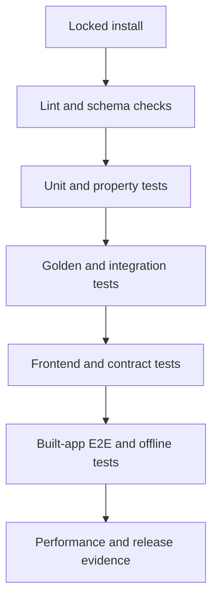

# ResiliTrip — Test Strategy and Golden Validation Specification

**Document:** 09 of the ResiliTrip implementation pack  
**Version:** 1.0  
**Date:** 6 September 2026  
**Status:** Proposed final pre-coding specification  
**Depends on:** Documents 01–08  
**Feeds:** Implementation, CI, demo rehearsal and release decision  
**Execution model:** One Codex account; sequence work by dependency, with no person assignments

## 1. Purpose

This document defines how Codex must prove that ResiliTrip is correct, coherent, usable and demo-safe. It closes the previously undefined PRD test references T01–T22, adds coverage for guarded remaining-journey editing, and fixes the golden files and release gates required before presentation.

The implementation may refine file paths and test helper names, but it must not weaken an expected result, merge distinct product states, replace backend behavior with mocked cards, or claim success without the required evidence.

## 2. Test authority and conflict rule

Use this oracle order when documents or implementation disagree:

1. Document 01 owns P0 scope, exclusions and claim boundaries.
2. Document 02 owns user-visible requirements and NFRs.
3. Document 03 owns domain meanings and invariants.
4. Document 04 owns exact hero fixture values and calculations.
5. Document 05 owns algorithm behavior and deterministic ordering.
6. Document 06 owns architecture, transactions and runtime boundaries.
7. Document 07 owns serialized API contracts.
8. Document 08 owns interaction, copy meaning and accessibility behavior.
9. This document owns test IDs, evidence form and release gates.

If two higher-authority documents genuinely conflict, stop implementation of the affected behavior and record the contradiction. A test must not silently choose the easier interpretation.

## 3. Test principles

| Principle | Required practice |
|---|---|
| Test observable truth | Assert exact values, states and machine codes—not only HTTP 200 or visible text |
| One shared evaluator | Impact, planning and adoption tests exercise the same real constraint implementation |
| Real generated alternatives | Golden plans assert atomic activity/service sequences; prebuilt recommendation cards are forbidden |
| Determinism | Stable inputs produce byte-stable canonical domain output and stable ordered plans |
| Isolation | Every mutation test starts from a named clean snapshot or database |
| Unknown is distinct | Unknown, infeasible, no-plan, partial-search and system error receive separate assertions |
| Mutation safety | Assert both the intended write and everything that must remain unchanged |
| Consumer equivalence | Map, timeline, cards and accessible route list render the same snapshot |
| Offline first | Hero success cannot require live APIs, public map tiles, fonts or CDNs |
| Honest simulation | Every plan remains simulated and non-bookable; adoption never changes providers |
| Evidence before coverage | Passing critical cases matters more than a high line-coverage number |
| Reproducibility | A clean Windows/container run is part of correctness, not an optional deployment task |

## 4. Required test stack

| Layer | Required tool | Purpose |
|---|---|---|
| Python unit/integration | `pytest` | Domain, application, repository and API behavior |
| Python properties | `Hypothesis` | Boundary/invariant generation for times, money, DAGs and versions |
| API transport | FastAPI test client or `httpx` ASGI transport | Exact status, headers and response models |
| Frontend unit/component | `Vitest` + Testing Library | State reducers, formatters, copy mapping and interactions |
| Browser E2E | `Playwright` | Real API + built frontend + SQLite flows |
| Accessibility | `@axe-core/playwright` plus manual keyboard checks | Automated violations and interaction equivalence |
| Contract generation | OpenAPI export + `openapi-typescript` | Backend/frontend schema agreement |
| Performance | `pytest-benchmark` or a small locked benchmark harness | 100 warmed impact-and-search measurements |

All exact versions are added to the lockfiles after Architecture Gate A0 proves the combination. No test may depend on network-installed assets at runtime.

## 5. Test directory contract

```text
apps/api/tests/
├── unit/
│   ├── test_validation.py
│   ├── test_time_and_windows.py
│   ├── test_constraints.py
│   ├── test_impact.py
│   ├── test_search.py
│   ├── test_finance.py
│   ├── test_frontier_and_ranking.py
│   └── test_explanations.py
├── integration/
│   ├── test_fixture_loading.py
│   ├── test_events.py
│   ├── test_planner.py
│   ├── test_itinerary_edits.py
│   ├── test_adoption.py
│   ├── test_reset.py
│   ├── test_concurrency.py
│   └── test_repository_integrity.py
├── contract/
│   ├── test_api_errors.py
│   ├── test_openapi.py
│   ├── test_response_coherence.py
│   └── test_privacy_schema.py
├── golden/
│   ├── test_hero_golden.py
│   └── test_perturbations.py
└── conftest.py

apps/web/src/tests/
├── unit/
├── components/
└── contract/

apps/web/e2e/
├── hero.spec.ts
├── itinerary-edit.spec.ts
├── failure-states.spec.ts
├── accessibility.spec.ts
├── offline.spec.ts
└── responsive.spec.ts

data/golden/
├── README.md
├── baseline.snapshot.json
├── d1.snapshot.json
├── plans.cheapest.json
├── plans.fastest.json
├── plans.fewest-changes.json
├── budget-7000.plans.json
├── budget-5000.no-plan.json
├── adoption-f3.response.json
├── edit-journey.response.json
├── reset.response.json
└── api-problems.json
```

Golden files are reviewed specifications, not snapshots blindly updated by a test runner.

## 6. Test environments

### 6.1 Unit environment

- Pure functions receive an explicit `ReplayClock` time.
- No SQLite, HTTP, browser, wall clock or network.
- Domain objects are built through validated factories shared with fixture tests.
- Stable ID ordering is explicit; tests do not rely on dictionary or database row order.

### 6.2 Integration environment

- Use a fresh temporary SQLite database per test unless a test explicitly verifies concurrent access.
- Enable foreign keys, WAL and the configured busy timeout.
- Load the real `mumbai-goa-v2` fixture through the production fixture loader.
- Use real repositories and the real evaluator/planner.
- Replace only the clock, failure injector or runtime guard when required by the case.

### 6.3 Browser environment

- Start the production-like single-container or equivalent built frontend/API process.
- Use the installed Playwright Chromium revision and fixed viewports.
- Reset or recreate the scenario before every test.
- Disable CSS animation for screenshot assertions, but run one separate motion-behavior test.
- Browser tests must not intercept planner endpoints with invented plan payloads.

### 6.4 Offline environment

Start the local app, then deny all non-loopback traffic. The test must still load the fixture, display the route, apply D1, generate plans, preview/adopt a simulated plan and reset. A local map fallback is valid; remote tiles are not.

## 7. Fixture and state builders

Provide test helpers with these semantics:

| Helper | Result |
|---|---|
| `baseline_trip()` | Valid hero trip version 1 at 05:00 IST |
| `after_d1_trip()` | Version 2 with T1 effective 09:00–18:30 |
| `after_d1_plans(preset)` | Version-2 planner result for the requested preset |
| `with_cash_limit(paise)` | New version with only cash limit changed |
| `with_service_event(service, values)` | Absolute event applied to a clean named branch |
| `at_replay_time(instant)` | CurrentState/replay clock at the exact supplied instant |
| `invalid_fixture(NEG_ID)` | One minimal mutation of the canonical manifest |
| `edit_capable_trip()` | Small valid synthetic manual trip with a frozen prefix, two optional same-location future activities and one hard final commitment |
| `fresh_db()` | Empty initialized database with production pragmas |

Every builder returns a new immutable object or isolated database. FX-01–FX-15 must not share mutated state.

`edit_capable_trip()` exists only because every activity in the hero fixture is hard and its order is physically meaningful. Its two optional future activities share a location, use non-overlapping flexible windows that permit either order, and precede one hard commitment. It is the authoritative positive fixture for harmless reorder/removal. The hero remains authoritative for H1/E1 acknowledgement, stale previews, fixed-service protection and all presentation values. Tests must not pretend that an impossible hero reorder is valid.

## 8. Canonical golden values

### 8.1 Baseline and disruption

| State | Venue arrival | Wedding slack | Hotel result |
|---|---|---:|---|
| Baseline v1 | 17:50 IST | +85 min | feasible |
| D1 v2 | 20:50 IST | −95 min | check-in starts 20:00, feasible through 21:00 |

D1 changes T1 effective times from 06:00–15:30 to 09:00–18:30 exactly once. It never shifts another fixed service.

### 8.2 Recovery plans

| Plan | Venue arrival | Slack | Cash required | Incremental cost | Result |
|---|---|---:|---:|---:|---|
| F2 via GOX | 13:35 | +340 min | ₹9,700 | ₹8,400 | feasible |
| F3 via GOI | 17:20 | +115 min | ₹6,500 | ₹5,200 | feasible |
| F4 via GOX | 20:05 | −50 min | ₹5,700 | ₹4,400 | rejected |
| Wait for T1 | 20:50 | −95 min | ₹1,300 | ₹0 | rejected |

Expected orders:

- `cheapest`: F3, F2;
- `fastest`: F2, F3;
- `fewest_changes`: F3, F2;
- F4 and Wait never enter the feasible order.

### 8.3 Critical boundaries

| Boundary | Pass | Fail/other |
|---|---|---|
| Wedding slack | 0 seconds is feasible `at_risk` | −1 second is infeasible |
| Risk threshold | 1,800 seconds is feasible, not at-risk | 1,799 seconds is `at_risk` |
| Readiness cutoff | arrival exactly at cutoff passes | one second after fails |
| Hotel latest start | start exactly 21:00 passes | one second after fails |
| Cash/increment limit | exactly equal passes | one paise over fails |
| Plan validity | replay time before `valid_until` passes | equal to or after expires |

## 9. Golden file rules

Each golden JSON file must:

- validate against the current Pydantic/OpenAPI schema;
- use canonical key ordering and normalized timestamps;
- contain complete arrays—no comments, ellipses or omitted plan steps;
- include expected version/catalog references;
- preserve `simulated=true`, `bookable=false` and applicable truth labels;
- contain only deterministic fields.

Exclude request IDs, database creation timestamps, benchmark durations and other run-specific metadata from byte-equality goldens. Test those fields by type/range separately.

Golden updates require a written reason in `data/golden/README.md`. The update command must write proposed files to a temporary directory and show a diff; it must not overwrite accepted goldens automatically.

## 10. Required acceptance tests T01–T30

### T01 — Fixture and manual-input validation

Assert that `mumbai-goa-v2` loads as version 1 with all references resolved and baseline reconciliation correct. Unknown scenario returns 404. Minimal valid manual input succeeds; missing timezone, duplicate ID, cyclic dependency and unsupported party size return normalized 422 responses with exact field paths.

**Trace:** P0-01–03; FR-001–004; API-01–04.

### T02 — Connected journey projection

Assert that map projection, journey timeline/table and dependency projection contain the same activity IDs, order, mode, endpoints and selected-state mapping. The accessible list contains all facts needed without the map.

**Trace:** P0-04/P0-19; FR-005–007; UX-01–03/19.

### T03 — Baseline evaluation golden

Load the real fixture and assert venue arrival 17:50, wedding slack +5,100 seconds, overall feasible state and no unexpected impact records. Serialize to `baseline.snapshot.json`.

**Trace:** P0-07; FR-006/012; ALG-03/04/07.

### T04 — D1 timing event

Apply D1 to version 1 and assert applied disposition, version 2, T1 effective 09:00–18:30, immutable catalog bytes/hash and complete recalculated snapshot. No other fixed service time changes.

**Trace:** P0-05; FR-008/011; ALG-01–03; API-05–07.

### T05 — D1 causal impact golden

Assert venue arrival 20:50, wedding slack −5,700 seconds, hotel start 20:00 and hotel feasibility. The wedding impact references D1 and the deterministic shortest causal activity path.

**Trace:** P0-07; FR-011–013; UX-06.

### T06 — Time and slack boundaries

Parameterize the critical boundaries in §8.3, including timezone offset parsing and date rollover. Assert exact feasibility status and observed/required evidence values.

**Trace:** P0-08; FR-012; ALG-04.

### T07 — Location, windows and current state

Assert flexible activities schedule through declared windows without duplicate duration. GOI arrival cannot use GOX transfer. Onboard T1 with no supported recovery point returns needs-input/unsupported current state and never proposes teleportation to CSMT.

**Trace:** P0-03; FR-003/011/015; ALG-03/05; FX-11.

### T08 — Hero plan generation and ranking

After D1, enumerate from atomic catalog records and assert complete search, feasible set `{F2,F3}`, rejected representatives containing F4 and Wait, exact activity sequences and all three preset orders. No stored complete-plan template may be read by the enumerator.

**Trace:** P0-09–11; FR-014–019; ALG-06–13.

### T09 — ₹7,000 budget

Replace constraints from a clean D1 branch, assert one version increment and stale previews, then regenerate. F3 is the only feasible plan; F2 contains `CASH_LIMIT_EXCEEDED` evidence.

**Trace:** P0-12/P0-16; FR-020; FX-01.

### T10 — ₹5,000 no-plan

From a clean D1 branch, set cash to ₹5,000 and exhaust the bounded search. Assert `no_feasible_catalog_plan`, no certified plan, blockers present and no error response. If P1 relaxation is enabled separately, the minimum is ₹6,500; P0 must not change the constraint automatically.

**Trace:** P0-12/P0-18; FR-016/019/020/031; FX-02; UX-18/24.

### T11 — Perturbation matrix

Execute FX-03–FX-11 and FX-15 independently and assert every valid/unknown/rejected set and reason from Document 04 §19. Partial traversal returns `partial_search`, never a global cheapest/fastest claim, and remains non-adoptable.

**Trace:** P0-06/P0-18; ALG-08/13/15; API-11–13.

### T12 — Money reconciliation

Assert exact F2/F3/F4/Wait line items, totals and incremental calculations. Repeated activity references cannot duplicate a charge. Unknown potential refund is null/separate and never reduces cash. Equality passes; one paise over fails.

**Trace:** P0-13; FR-021–024; ALG-09/10; UX-10.

### T13 — F3 adoption

Adopt server-owned F3 using the current versions and literal acknowledgement. Assert one version increment, adopted proposed itinerary, unchanged Bookings, `external_booking_executed=false`, provider actions all `not_started`, and other previews stale.

**Trace:** P0-15; FR-025–029; ALG-14/15; API-15–17; UX-16/17.

### T14 — Policy and provider handoff

Assert fictional scenario policy calculations only use declared fixture terms. Provider actions use closed provider keys and contain verification guidance without invented entitlement, live availability or arbitrary request URLs.

**Trace:** P0-21/P0-22; FR-023/024/029; API-D15.

### T15 — Provenance and truth labels

Assert visible critical facts resolve to their provenance record and source class. Setup, workspace, comparison and adoption retain synthetic/non-bookable meaning. No synthetic value is labeled live, verified, booked or provider-confirmed.

**Trace:** P0-14/P0-22; FR-032; UX-22.

### T16 — Distinct planner and product states

Test `complete`, `no_feasible_catalog_plan`, `needs_input`, `partial_search`, stale/conflict, offline-map and system-error behavior. Assert distinct response/state codes, headings and permitted actions; no-plan is 200 domain output, not 404/409/500.

**Trace:** P0-18; FR-031; API-11/20; UX-18.

### T17 — Stale protection and reset

Generate previews, mutate the trip, and assert old adoption fails without writing. Reset restores canonical baseline content at current version +1, stales all prior plans and allows the full scenario to run again without process restart.

**Trace:** P0-16/P0-17; FR-026/028/030; ALG-15/16; API-18.

### T18 — Offline core

With external network denied, complete load → inspect → D1 → impact → generate → compare → preview/adopt → reset. Force map failure and assert route list/fallback remains fully usable.

**Trace:** P0-20; FR-007/033; ARC-02/11; UX-19.

### T19 — Cancellation and event conflicts

Cancel T1 and assert original traversal blocked while valid flight recovery remains. Exercise FX-12–FX-14: duplicate D1 no-op, changed reuse of D1 ID conflict and stale expected version conflict. No failure creates a partial write.

**Trace:** P0-06; FR-009; ALG-01/02; API-07/08.

### T20 — Atomicity and concurrency

Inject a failure before each mutation commit and assert no new version/audit/adoption/edit/event survives. Concurrent identical D1 calls apply once; concurrent different commands using the same expected version produce exactly one successful version increment and one conflict.

**Trace:** NFR-07; ARC-06–08; API-06–09.

### T21 — Snapshot and frontend version coherence

Assert every snapshot has one trip/catalog version pair and all nested plans match it. Simulate a planner response arriving after a newer mutation; the frontend guard rejects it, preserves the last good snapshot and shows refresh guidance.

**Trace:** P0-19; FR-034; ARC-09; API-21/24; UX-24.

### T22 — Explanation and rejected-option clarity

Assert F4 and Wait appear only as rejected, with exact observed arrival and required cutoff. Render human copy from structured checks; the UI must say F4 is 50 minutes late without exposing raw codes in the normal view.

**Trace:** P0-10/P0-18; FR-018; ALG-18; UX-09/21.

### T23 — Guarded remaining-journey editing

Test the full itinerary-edit command:

1. on `edit_capable_trip()`, valid reordering of the two editable future optional activities saves one coherent version;
2. on `edit_capable_trip()`, valid optional removal succeeds;
3. completed activity modification returns `COMPLETED_ACTIVITY_IMMUTABLE`;
4. current activity/service modification returns `ACTIVE_ACTIVITY_IMMUTABLE`;
5. hard removal without acknowledgement returns `HARD_CHANGE_ACKNOWLEDGEMENT_REQUIRED`;
6. acknowledged hard removal succeeds only if the resulting itinerary/constraints remain valid;
7. cyclic, disconnected, location-inconsistent or commitment-order mismatch is rejected;
8. service times, catalog, effective-service state, original itinerary and Bookings remain unchanged;
9. material save increments once and stales previews;
10. identical canonical replacement is a no-op.

**Trace:** P0-23; FR-035; ALG-19; API-26–29; UX-12–15.

### T24 — API and OpenAPI contract

Assert unknown fields, wrong discriminators, Boolean/fractional money, naive timestamps, oversized requests and wrong media types return the documented normalized response. Export OpenAPI, validate all examples, regenerate TypeScript and fail on an uncommitted diff.

**Trace:** NFR-09; API-01–04/19/20/22/23.

### T25 — Frontend component/state tests

Using real contract-shaped fixtures, test synchronized selection, report-problem flows, ranking controls, plan preview, stale refresh, editable-draft preservation and central code-to-copy mapping. Components never calculate authoritative slack, money or eligibility.

**Trace:** ARC-03/12/20; UX-03–18/21.

### T26 — Accessibility and responsive behavior

At 1440×900, 1024×768 and 390×844, assert no horizontal page overflow, reachable primary action, logical focus order, visible focus, keyboard operation and non-color status. Reduced motion removes vehicle/path animation. Automated scans report zero critical/serious violations on setup, workspace, recovery and adoption; manually verify map-equivalent list use.

**Trace:** NFR-05; UX-19/20/23.

### T27 — Privacy, logging and security boundaries

Audit P0 schemas for absence of PNR, Aadhaar, passport, payment and email fields. Send malicious labels and assert escaped rendering. Captured logs/errors omit arbitrary text, booking references, URLs, SQL, stack traces and database paths. Cross-trip plan lookup returns `PLAN_NOT_FOUND`.

**Trace:** NFR-08/09; ARC-13/14; API-14/25.

### T28 — Persistence integrity

Assert canonical snapshot hashes on write/read, foreign keys enabled and catalog immutability. Corrupt a copied test row and require `INTERNAL_DATA_INTEGRITY_ERROR`; planning must not continue. Reset and event commits preserve referential integrity.

**Trace:** ARC-04/05/15; API-05/21.

### T29 — Performance and runtime guard

After five warmups, run 100 complete hero impact-plus-search calls on the recorded demo hardware. Record p50, p95, max, CPU, RAM, OS/container, Python version, catalog size, bounds and complete/partial counts. Gate target: p95 below one second. Separately force the runtime guard and assert truthful `partial_search`, not false no-plan.

**Trace:** NFR-02/03; ARC-16; ALG-13.

### T30 — Clean build and repeated demo

From a clean checkout and locked dependencies, build and launch through the documented Windows/PowerShell or container route. Complete the hero script five consecutive times, including reset, with zero mixed-version state or manual database repair. Record a backup video only after this passes.

**Trace:** NFR-12; ARC-01/17–19; UX-24.

## 11. Negative fixture suite

Implement every Document 04 NEG-01–NEG-15 case as a minimal derivative of the canonical fixture. Each test asserts:

- exact rejection layer: schema, aggregate validation or event union;
- normalized code and field path;
- no persisted catalog/trip/version on failure;
- no leaked native framework error.

Additional itinerary-edit negatives:

| Negative ID | Change | Expected result |
|---|---|---|
| NEG-16 | Remove a completed activity | `COMPLETED_ACTIVITY_IMMUTABLE` |
| NEG-17 | Replace the active transport | `ACTIVE_ACTIVITY_IMMUTABLE` |
| NEG-18 | Remove H1 or E1 without acknowledgement | `HARD_CHANGE_ACKNOWLEDGEMENT_REQUIRED` |
| NEG-19 | Reorder required IDs but retain contradictory dependencies | `ITINERARY_EDIT_INVALID` or normalized dependency error |
| NEG-20 | Change F3 scheduled time inside itinerary payload | rejected; catalog remains byte-identical |
| NEG-21 | Omit a required field from full edit replacement | `MISSING_FIELD` |

## 12. Property-based tests

Hypothesis tests must use bounded generators so failures shrink into readable examples.

| Property ID | Generated space | Invariant |
|---|---|---|
| PROP-01 | Aware datetimes around cutoffs | Equality/one-second boundary semantics remain exact |
| PROP-02 | Nonnegative paise totals and limits | Equality passes; one paise over fails; no float conversion |
| PROP-03 | Small valid DAGs | Stable topological order respects every dependency |
| PROP-04 | DAG plus one back edge | Cycle always rejected before evaluation |
| PROP-05 | Valid small catalogs with shuffled input arrays | Canonical ordered result remains identical |
| PROP-06 | Duplicate activity references to one charge | Financial item counted exactly once |
| PROP-07 | Current locations and next legs | No accepted transition starts from a different physical location |
| PROP-08 | Same valid event command repeated | At most one version increment |
| PROP-09 | Any material accepted mutation | Version increases exactly one; prior previews stale |
| PROP-10 | Future-suffix edits | Frozen prefix remains byte-equivalent |
| PROP-11 | Feasible plan pairs | Pareto frontier contains no plan dominated by another returned plan |
| PROP-12 | Canonical serializable records | Serialize → parse → serialize produces identical bytes |

Use fixed CI seeds plus normal randomized local runs. A failure prints the seed and minimized input.

## 13. Mutation and race test matrix

| Race | Setup | Required outcome |
|---|---|---|
| Duplicate event/event | Same D1 command in two callers | One applied, one duplicate; version +1 total |
| Event/event conflict | Same event ID, different values | One applied; other 409; no second write |
| Constraint/constraint | Same expected version, different limits | Exactly one succeeds; other version conflict |
| Edit/edit | Same expected version, different future suffix | Exactly one succeeds; other version conflict |
| Planner/event | Planner computes while event commits | Planner result discarded at save recheck |
| Planner/edit | Planner computes while journey edit commits | Planner result discarded at save recheck |
| Adoption/event | Both use same version | At most one versioned mutation succeeds |
| Adoption/expiry | Replay clock equals plan `valid_until` | Adoption fails, no adoption row/version |
| Reset/other mutation | Same expected version | At most one succeeds; resulting snapshot coherent |

Concurrency tests use barriers/hooks, not timing sleeps. A flaky race test is a defect in the test harness and cannot be marked optional.

## 14. API response invariants

Run these assertions against every success snapshot/plan response:

- schema validation succeeds with unknown fields forbidden;
- trip ID matches the path/request context;
- trip version is positive and matches nested records;
- catalog version matches the immutable catalog and every plan;
- IDs are unique and cross-references resolve;
- dependency graph is acyclic;
- plan totals equal unique MoneyItems;
- returned counts equal actual array lengths;
- feasible arrays contain only fully passed hard checks;
- uncertain arrays contain at least one required unknown and no failed hard check;
- rejected arrays contain at least one failed hard check;
- adopted/stale/preview lifecycle is internally consistent;
- simulation/bookability literals are preserved.

## 15. Frontend assertions

### 15.1 Do test

- Consumer-visible facts and actions.
- Server code → approved copy/action mapping.
- Selected activity/plan synchronization.
- Loading while preserving last good snapshot.
- Stale result rejection and refresh.
- Draft preservation after invalid journey edit.
- INR and IST formatting.
- Disclosure persistence.
- Keyboard, responsive and offline behavior.

### 15.2 Do not test as authority

- Recalculate feasibility, cash or slack in JavaScript.
- Assert internal CSS implementation details when behavior is sufficient.
- Mock a success payload that cannot validate against OpenAPI.
- Use pixel screenshots as proof of business correctness.
- Treat animation position as traveler state.

## 16. Visual regression set

Use the locked Chromium revision and local fonts/assets. Capture only these stable views:

| Screenshot ID | State | Viewports |
|---|---|---|
| VIS-01 | Baseline workspace | 1440×900, 390×844 |
| VIS-02 | D1 impact summary | 1440×900, 390×844 |
| VIS-03 | Recovery branches, cheapest | 1440×900, 390×844 |
| VIS-04 | F4 rejected detail | 1440×900 |
| VIS-05 | Journey edit warnings | 1440×900, 390×844 |
| VIS-06 | Adoption acknowledgement | 1440×900, 390×844 |
| VIS-07 | Offline map fallback | 1440×900 |

Mask only inherently nondeterministic run metadata. Do not mask route times, prices, statuses, disclosures or branch content. Screenshot diffs require human inspection; automatic baseline replacement is forbidden.

## 17. Accessibility checklist

Automated checks are necessary but insufficient. Manually verify:

- skip/main-region navigation;
- one logical page heading;
- keyboard access to map-equivalent journey selection;
- focus return after sheets/modals close;
- focus moves to error summary after rejected form submission;
- dialog focus trap and Escape behavior;
- status never conveyed by color alone;
- route branch lines have textual equivalents;
- screen-reader labels include mode, origin, destination, time and status;
- live regions announce completed recalculation without repeating entire pages;
- reduced-motion preference removes nonessential travel animation;
- 200% zoom does not hide actions or require two-dimensional scrolling.

## 18. Performance method

The benchmark measures the complete application call for impact evaluation plus bounded recovery search, including domain serialization and excluding frontend animation/network latency.

Procedure:

1. Record hardware and software metadata.
2. Use release-equivalent Python settings and real fixture/catalog.
3. Run five warmups not included in results.
4. Run 100 measured calls with identical version/preset.
5. Assert all 100 outputs have the same canonical hash and complete status.
6. Report p50, p95 and max using wall-clock monotonic timing.
7. Save results to `artifacts/performance/hero-benchmark.json`.

Do not claim the target as achieved until this artifact exists. If p95 exceeds one second, first inspect repeated validation/serialization and search bounds; do not hide the result by increasing timeout labels.

## 19. Coverage gates

Coverage is a guardrail, not the release oracle.

| Area | Minimum | Additional requirement |
|---|---:|---|
| Domain validation/constraints/impact/finance | 90% branch | Every hard-constraint boundary explicitly tested |
| Search/frontier/ranking | 85% branch | F2/F3/F4/Wait and FX-01–15 all pass |
| Application mutations/repositories | 85% branch | Every rollback/conflict branch in §13 exercised |
| API routes/contracts | 85% statement | Every endpoint has success and applicable error tests |
| Frontend state/copy/format helpers | 80% branch | Every product state and code mapping exercised |
| Critical Playwright flow | scenario coverage | T18, T23, T26 and T30 pass; line coverage not applicable |

No uncovered path may certify a plan, mutate a trip, adopt a plan, remove a hard activity or label external action complete.

## 20. Required commands

Implementation must provide cross-platform commands with these stable intentions. Exact wrappers may be shell/PowerShell scripts or package commands.

```text
bootstrap         install locked dependencies and Playwright browser
test-unit         Python and frontend unit/component tests
test-contract     OpenAPI export, examples, generated types and contract tests
test-golden       baseline, D1, plans, perturbations and money goldens
test-integration  SQLite/API mutation, concurrency and integrity tests
test-e2e          browser tests against production-like local app
test-offline      network-denied hero path
test-performance  recorded 100-run benchmark
test-all          all blocking automated suites except manual usability
demo-reset        restore a named demo trip through supported behavior
```

`test-all` exits nonzero on any blocking failure and prints the first actionable failure plus the command to rerun that group. It must not rewrite goldens, screenshots or lockfiles.

## 21. CI order and fail-fast rules



Fail immediately before browser tests when:

- lockfile install or build fails;
- OpenAPI/generated types differ;
- fixture/golden arithmetic differs;
- any hard-constraint or mutation-safety case fails;
- privacy-schema audit fails.

Performance can run after functional tests but remains blocking for the claim “p95 below one second.” If the product otherwise works, the demo may proceed only with the performance claim removed and the target clearly described as unmet.

## 22. Manual usability evidence

After the automated integrated flow is stable, test five people unfamiliar with the project. Do not coach them through the answers.

Ask each person to:

1. identify what is happening now and the next travel mode;
2. report the train delay;
3. choose the cheapest feasible plan;
4. explain why F4 is rejected;
5. say whether using F3 purchased or changed a booking.

Record completion, time, answer accuracy and confusion without collecting unnecessary personal data. Release target: 5/5 correctly identify F3, the hard-deadline failure and no external booking. If not met, fix wording/interaction and repeat with new participants before adding P1 features.

## 23. Demo rehearsal checklist

Before each judged run:

- production-like app launches through the documented command;
- correct local URL opens in the target browser;
- fixture and database are reset through the supported reset path;
- baseline is version-coherent and shows 17:50/+85 min;
- browser zoom is 100%; viewport fits the prepared layout;
- notifications and unrelated applications are closed;
- external network may be disabled without harming core flow;
- map fallback and route list are available;
- D1, recovery, F4 explanation, F3 adoption and reset were smoke-tested;
- backup video exists locally and plays without network;
- no P1 flag or unfinished control is visible.

## 24. Release gates

### Gate A0 — Compatibility

- Python 3.12 and Node 22 clean locked installs succeed.
- Direct imports, SQLite pragmas, MapLibre/graph smoke pages and production build succeed.
- Exact dependency and browser revisions are recorded.

### Gate A1 — Schema and fixture

- T01–T03, T06, T07 and NEG-01–NEG-21 pass where implemented at this layer.
- Canonical fixture validates and baseline golden matches.
- OpenAPI schema names and generated TypeScript succeed.

### Gate A2 — Domain and planner

- T04–T12 and all FX-01–FX-15 pass.
- ALG-01–ALG-19 pass.
- Determinism/property tests pass with recorded seeds.

### Gate A3 — Mutations and contracts

- T13–T24 and T27–T28 pass.
- API-01–API-29 and ARC-04–ARC-10/13–16/19–20 pass.
- Rollback and concurrency evidence is clean.

### Gate A4 — Integrated UX

- T02, T16–T18 and T21–T26 pass in the built app.
- UX-01–UX-23 pass at desktop and mobile targets.
- Zero critical/serious automated accessibility violations; manual checklist complete.

### Gate A5 — Demo release

- T29 meets the stated performance target or the performance claim is removed.
- T30 passes five consecutive times.
- Five-person comprehension target passes.
- Offline rehearsal and backup video pass.
- All P0 controls work from real backend responses.
- Feature freeze begins; only defects may be changed.

P1 work is forbidden before A5.

## 25. Failure triage

| Failure class | Stop condition | Correct response |
|---|---|---|
| Golden arithmetic differs | Always | Compare atomic fixture/evaluator; never update expected value casually |
| Hard constraint falsely passes | Always | Block release and fix shared evaluator |
| Mixed versions | Always | Preserve last good snapshot; fix version guard/transaction |
| Mutation partial write | Always | Fix transaction before any UI work |
| Offline map missing | Core data still works | Use required fallback; do not add live tile dependency |
| Visual screenshot changed | Inspect | Accept only intentional reviewed UX change |
| Accessibility critical/serious | Always for core screens | Fix before A4 |
| Performance target missed | Claim-specific | Optimize or remove claim; do not falsify measurement |
| Browser-only flake | Investigate | Fix deterministic state/readiness; never add blind sleep |
| External provider unavailable | Not a core failure | Core remains local; provider checklist may remain unverified |

## 26. Traceability summary

| Requirement group | Primary evidence |
|---|---|
| P0-01–04 input/connected journey | T01–T03 |
| P0-05–08 disruption/impact/risk | T04–T07/T19 |
| P0-09–13 recovery/ranking/money | T08–T12/T22 |
| P0-14 evidence | T15 |
| P0-15–17 adoption/stale/reset | T13/T17/T20/T21 |
| P0-18 failure states | T10/T11/T16 |
| P0-19 visualization coherence | T02/T21/T25/T26 |
| P0-20 offline core | T18/T30 |
| P0-21–22 provider/truth boundary | T14/T15/T27 |
| P0-23 remaining-journey edit | T23 |
| NFR-01/06 determinism/consistency | T08/T21/PROP-05/12 |
| NFR-02/03 performance/response | T29 |
| NFR-04/05 offline/accessibility | T18/T26 |
| NFR-07/10 integrity/recovery | T17/T19/T20/T28 |
| NFR-08/09 privacy/input safety | T01/T24/T27 |
| NFR-11 explainability | T05/T12/T22 |
| NFR-12 reproducibility | T30/Gate A0 |
| UX-01–24 | T02/T05/T10/T13/T15–T18/T21–T26/T30 |

## 27. Decisions fixed by this document

| Decision ID | Resolution |
|---|---|
| TEST-D01 | Define PRD acceptance tests as T01–T30 |
| TEST-D02 | Use real canonical fixture and evaluator in integration/E2E recovery tests |
| TEST-D03 | Store complete deterministic JSON goldens under `data/golden` |
| TEST-D04 | Require reviewed diffs; tests never overwrite accepted goldens |
| TEST-D05 | Use isolated named branches for every FX perturbation |
| TEST-D06 | Make concurrency deterministic with barriers/hooks, not sleeps |
| TEST-D07 | Treat guarded itinerary editing as a blocking P0 mutation suite |
| TEST-D08 | Require network-denied core E2E behavior |
| TEST-D09 | Require zero critical/serious automated accessibility violations plus manual checks |
| TEST-D10 | Keep performance evidence claim-specific and hardware-recorded |
| TEST-D11 | Require five consecutive demo runs and five-person comprehension before P1 |
| TEST-D12 | Sequence implementation by gates without person assignments |

## 28. Implementation instructions for Codex

1. Run Gate A0 before writing substantial product code.
2. Create the canonical fixture and goldens alongside the domain models, not after the UI.
3. Implement tests for each layer as its behavior is introduced.
4. Do not mark a test skipped because the corresponding P0 feature is inconvenient; either implement it or report the P0 blocker.
5. Keep P1 cases excluded until Gate A5, except the explicitly conditional minimum-cash assertion.
6. Never weaken an assertion merely to match current output.
7. Preserve failing minimized property examples as regression tests when they expose a real defect.
8. Keep run-specific evidence under `artifacts/`; keep normative expected results under `data/golden/`.
9. At the end of each gate, record the exact commands and results before proceeding.
10. After A5, create the short operational README/runbook while coding; no additional large planning document is required.

## 29. Approval and coding handoff

The pre-coding documentation pack is complete when this document is accepted. Coding may start with Gate A0 and proceed through A1–A5.

The implementation must stop and ask for a product decision only when:

- a higher-authority document conflict changes observable behavior;
- organizer rules prohibit the planned pre-event scaffold or dependencies;
- the demo machine cannot support the locked runtime after a clean compatibility trial; or
- a requested feature would cross the explicit simulation/privacy/provider boundary.

Everything else in P0 is sufficiently specified for Codex to implement and verify without another planning document.
